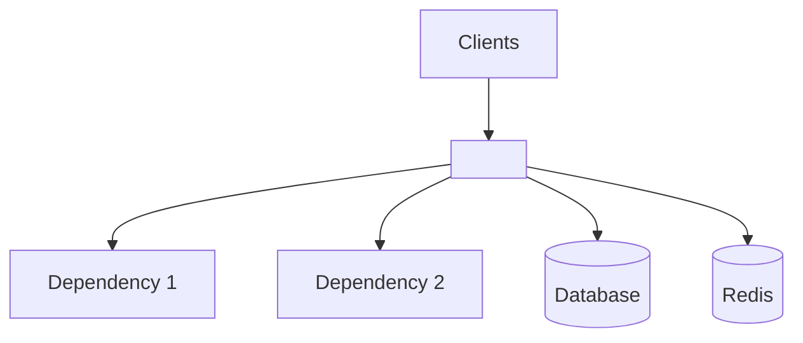
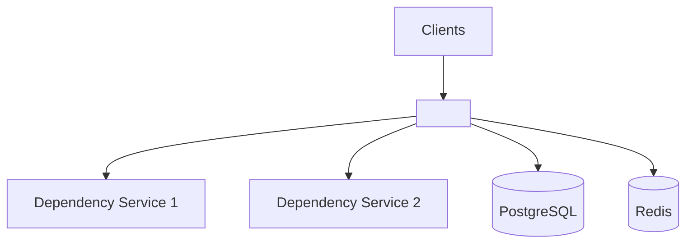
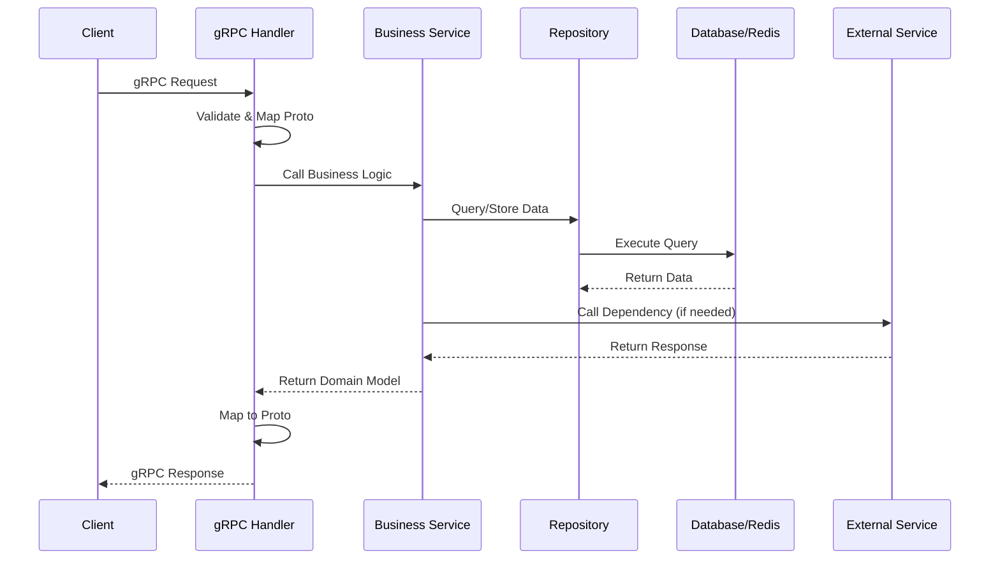
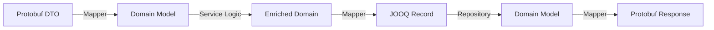
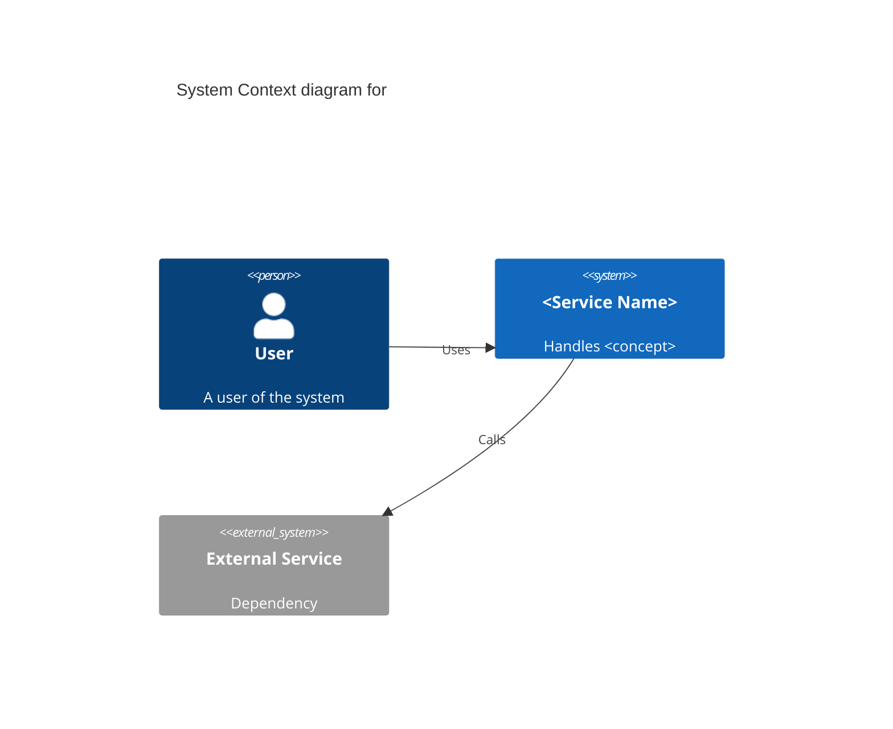
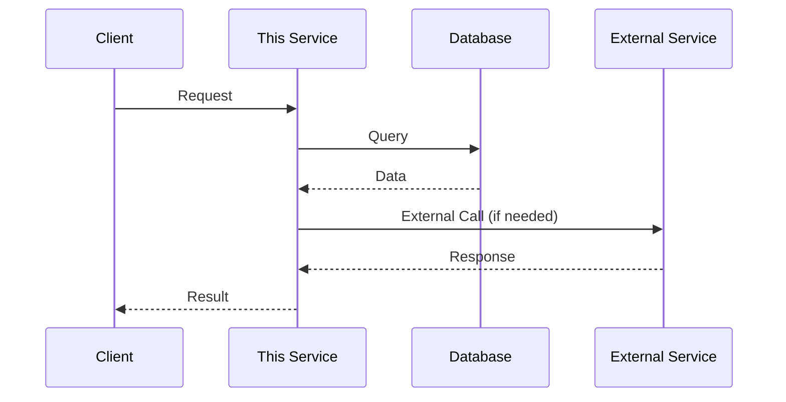

# Generate comprehensive AI-friendly documentation for Java services. This command mirrors the automated generate-documentation GitHub Action workflow (bitsoex/actions/generate-documentation) which is expected to be fully automated in the future. Use this for manual documentation generation when the automated pipeline is not yet enabled.

**Description:** Generate comprehensive AI-friendly documentation for Java services. This command mirrors the automated generate-documentation GitHub Action workflow (bitsoex/actions/generate-documentation) which is expected to be fully automated in the future. Use this for manual documentation generation when the automated pipeline is not yet enabled.

# AI Documentation Generation for RAG System

Generate comprehensive AI-friendly documentation in the `docs/` folder for this repository. This documentation will be used in a RAG (Retrieval-Augmented Generation) system to answer technical questions about the codebase.

**Standard**: This follows RFC-37 Service Documentation Standardization structure.

## ⚠️ IMPORTANT: Idempotency and Change Detection

**This prompt runs on every commit. You MUST follow these rules to avoid unnecessary changes:**

### Change Detection Rules

1. **Only update documentation when the underlying code/structure has changed**
2. **Preserve existing content if the code hasn't changed**
3. **Do NOT rewrite documentation just to rephrase things**
4. **Do NOT change formatting, ordering, or style if content is accurate**
5. **Do NOT regenerate timestamps unless actual content changed**

### Before Making Changes

For each document, ask yourself:
- Has the component/feature/integration actually changed?
- Is the existing documentation accurate?
- Am I adding new information or just rewording?

### What Constitutes a Change

**UPDATE documentation when:**
- New features or concepts are added
- Existing features have new functionality or business rules
- Architecture changes (new dependencies, databases, services)
- API contracts change (new RPCs, modified messages)
- Configuration changes (new environment variables, settings)
- Database schema changes
- Error codes or business rules change
- Domain concepts or components organization changes

**DO NOT update documentation when:**
- Code formatting or comments change
- Variable names change but behavior is the same
- Tests are added/modified but functionality is unchanged
- Internal refactoring without API changes
- Documentation is already accurate

### Idempotent Updates

When updating:
1. **Read existing documentation first**
2. **Compare with current codebase state**
3. **Only modify sections that are outdated or incomplete**
4. **Preserve existing structure and formatting**
5. **Keep the same writing style and tone**
6. **Only update `updated: YYYY-MM-DD` in frontmatter if content changed**

### Example Decision Process

```
Question: Should I update orders/overview.md?

Check:
- ✓ Read existing orders/overview.md
- ✓ Check if new features were added → NO
- ✓ Check if core responsibilities changed → NO
- ✓ Check if dependencies changed → NO
- ✓ Is current doc accurate? → YES

Decision: DO NOT UPDATE - documentation is accurate
```

```
Question: Should I update order-management/order-placement/README.md?

Check:
- ✓ Read existing order-placement/README.md
- ✓ Check proto files for changes → YES, new RPC added
- ✓ Check if existing RPCs modified → NO

Decision: UPDATE - add documentation for new RPC only
          Keep existing RPC documentation unchanged
```

## Documentation Strategy

This generates **service-specific** documentation that will be published to a central `bitso-services-docs` repository.

### What to Document (Service-Specific Only)
- ✅ Business purpose and domain concepts
- ✅ Service architecture (dependencies, data flow, deployment specifics)
- ✅ Domain concepts (what the service does, how it's architected, components organization)
- ✅ Features and use cases
- ✅ gRPC APIs and contracts
- ✅ Data models (PostgreSQL schema, Redis patterns)

### What NOT to Document (Covered in Platform Docs)
- ❌ General local development setup (Docker, Gradle, IDE)
- ❌ Testing patterns (Spock, Testcontainers, mocking)
- ❌ Monitoring and logging patterns (Datadog, structured logs)
- ❌ Common troubleshooting (database connections, Redis, etc.)
- ❌ Standard architecture patterns (DDD, layering, JOOQ usage)
- ❌ Technology stack overview (Java, Spring Boot, gRPC versions)
- ❌ Deployment processes (K8s, CI/CD)

These are maintained by the Platform team in the central repository.

## Objectives

1. **RAG-Optimized**: Structure content for semantic search and chunking
2. **Question-Answerable**: Enable answering "What/How/Why" questions about this specific service
3. **Business-Focused**: Emphasize business logic and domain concepts over common patterns
4. **Consistent**: Follow the exact structure and templates provided below
5. **AI-Maintainable**: Use consistent patterns that can be updated by AI in the future
6. **Idempotent**: Only update when code changes, avoid unnecessary churn

## Folder Structure

The `docs/` folder has a mixed structure where the AI maintains only the service-specific content:

```
docs/
├── api/                                 # Managed by humans
├── decisions/                           # Managed by humans
├── runbooks/                            # Managed by humans
└── <service-name>/                      # ✅ AI-MANAGED: One folder per service in bitso-services/
    ├── overview.md                      # Business purpose, domain concepts
    ├── architecture.md                  # Service architecture, dependencies, data flow
    ├── getting-started/                 # 
    ├── concepts/                        # Domain concepts and components
    │   ├── <concept-1>.md               # One or more files explaining domain concepts
    │   └── <concept-2>.md               # Components, architecture, dependencies
    └── features/                        # All features in one folder
        ├── <feature-1>.md               # One .md file per feature
        ├── <feature-2>.md
        └── <feature-N>.md
```


**Important Notes**:
- **One folder per service**: Each deployable service in `bitso-services/` gets its own subfolder
- **Service-centric**: Focus on services, not library modules (`bitso-libs/` are implementation details)
- **Multiple services**: If the repo has multiple services, document each separately
- **Platform docs**: Common patterns live in the central `bitso-services-docs/platform/` repository
- **Concepts**: Explain unique domain concepts, components organization, architecture (C4 diagrams encouraged)
- **Features**: Each feature is a separate `.md` file within the `features/` subfolder
- **Getting Started**: Optional `getting-started/` folder for tutorials and quick-start guides

**Example**: If a repository has `bitso-services/order-service/` and `bitso-services/order-consumer/`, create:
```
docs/
├── api/                     # Human-managed
├── decisions/               # Human-managed
├── runbooks/                # Human-managed
├── order-service/           # ✅ AI-managed
│   ├── overview.md
│   ├── architecture.md
│   ├── concepts/
│   │   ├── order-lifecycle.md
│   │   └── components.md
│   └── features/
│       ├── order-placement.md
│       └── order-matching.md
└── order-consumer/          # ✅ AI-managed
    ├── overview.md
    ├── architecture.md
    ├── concepts/
    │   └── ...
    └── features/
        └── event-processing.md
```

## Analysis Instructions

Before generating documentation:

1. **Check for Existing Documentation**:
   - Read all existing files in `docs/`
   - Compare with current codebase state
   - Identify what needs updating

2. **Identify All Services**:
   - **Primary focus**: Scan `bitso-services/` directory for all deployable services
   - Each subdirectory in `bitso-services/` is a separate service to document
   - Read each service's `build.gradle` and `application.yml` for configuration
   - Check if there are also any jobs in `bitso-jobs/` to document
   - **Create one documentation folder per service**

3. **Identify Domain Concepts**:
   - Understand unique business concepts specific to this service's domain
   - Identify how components are organized and their responsibilities
   - Map dependencies and how they relate to the service architecture
   - Consider using C4 diagrams to illustrate concepts
   - Identify which `bitso-libs/` modules this service uses (check dependencies in service's build.gradle)

4. **Discover Service Features**:
   - Analyze gRPC service definitions in proto files used by this service
   - Read existing docs/ folder for feature descriptions specific to this service
   - Examine service layer classes for business logic
   - Understand the end-to-end flows this service handles
   - Group related functionality into feature folders
   - Each feature should be comprehensive enough to warrant its own folder

## Documentation Templates

**Note**: All templates below are for files within a service folder (e.g., `docs/<service-name>/overview.md`)

### Template: `README.md` (Repository Root)

```markdown
# AI Documentation

This directory contains AI-generated documentation for the services in this repository.

## Services in This Repository

| Service | Description | Port |
|---------|-------------|------|
| `<service-name-1>` | <Brief description> | <port> |
| `<service-name-2>` | <Brief description> | <port> |

## Documentation Structure

Each service has its own documentation folder:

```
docs/
├── README.md (this file)
├── <service-1>/
│   ├── overview.md          # Business purpose
│   ├── architecture.md      # Dependencies, data flow
│   ├── concepts/            # Domain concepts and components
│   └── features/            # Features as individual .md files
└── <service-2>/
    └── ... (same structure)
```

## Documentation Philosophy

This documentation focuses on **service-specific information** following RFC-37:
- ✅ Business logic and domain concepts
- ✅ Service architecture and dependencies
- ✅ Domain concepts (components, architecture, dependencies)
- ✅ Features and APIs
- ✅ Data models

Platform-wide documentation (dev setup, testing, monitoring) lives in `bitso-services-docs/platform/`.

## Quick Links

- [Service 1 Overview](mdc:./<service-1>/overview.md)
- [Service 2 Overview](mdc:./<service-2>/overview.md)

## Maintenance

Documentation is auto-generated using `.cursor/commands/docs.md` and only updates when code changes.
```

---

### Template: `<service-name>/overview.md`

**Path**: `docs/<service-name>/overview.md`

```markdown
---
service: <service-name>
repository: <github-repo-name> (org name is always bitsoex)
service_path: bitso-services/<service-name>
domain: <business-domain>
related_services: [service1, service2, service3]
primary_language: Java
framework: Spring Boot
port: <grpc-port>
updated: <YYYY-MM-DD>
---

# Service Overview: <Service Name>

## Business Purpose

<2-3 sentences describing what business problem this service solves and why it exists>

## Core Responsibilities

- **Responsibility 1**: <What it handles>
- **Responsibility 2**: <What it handles>
- **Responsibility 3**: <What it handles>

## Domain Concepts

Define key business concepts used in this service:

- **Concept 1**: <Clear definition>
- **Concept 2**: <Clear definition>
- **Concept 3**: <Clear definition>

## Service Boundaries

### In Scope
<What this service owns and handles>

### Out of Scope
<What this service explicitly does NOT handle - mention which other services handle these>

## Key Use Cases

1. **Use Case 1**: <Description>
2. **Use Case 2**: <Description>
3. **Use Case 3**: <Description>

## Related Services

- **Service 1**: <How it relates - dependency, consumer, etc.>
- **Service 2**: <How it relates>
- **Service 3**: <How it relates>

## Architecture Overview



<Brief explanation of the diagram>
```

### Template: `<service-name>/architecture.md`

**Path**: `docs/<service-name>/architecture.md`

```markdown
---
service: <service-name>
service_path: bitso-services/<service-name>
section: architecture
tags: [architecture, dependencies, data-flow]
updated: <YYYY-MM-DD>
---

# Architecture

## Service Architecture Overview



<Brief explanation of the architecture>

## Module Structure

<Describe the purpose of each major module in bitso-libs/>

### Module: <module-name>
- **Path**: `bitso-libs/<module>/`
- **Purpose**: <What it does>
- **Key Packages**: 
  - `api/` - gRPC handlers
  - `service/` - Business logic
  - `persistence/` - Data access (JOOQ/Redis)
  - `client/` - External service clients
  - `domain/` - Domain models

## External Dependencies

### gRPC Services

#### <External Service Name>
- **Purpose**: <Why we depend on it>
- **Key RPCs Used**: <List>
- **Configuration**: `grpc.client.<service-name>`
- **Resilience**: Timeout=<X>s, Retries=<Y>, Circuit Breaker=<Yes/No>

<Repeat for each external service>

### Databases

#### PostgreSQL
- **Database**: `<db-name>`
- **Key Tables**: <List main tables>
- **Access**: JOOQ with HikariCP connection pooling
- **Read/Write Split**: <Yes/No - explain if yes>

#### Redis
- **Instances Used**:
  - **<Redis Instance 1>**: <Purpose and key patterns>
  - **<Redis Instance 2>**: <Purpose and key patterns>
- **Client**: Jedis/JedisPooled

## Request Processing Flow



### Key Flow Characteristics
- **Validation**: <What's validated and where>
- **Business Logic**: <Main processing steps>
- **Data Access**: <Read/write patterns>
- **Error Handling**: <How errors are handled>

## Data Flow

### Protobuf ↔ Domain ↔ Database



## Deployment Configuration

### Service Deployment
- **Port**: 8201 (gRPC)
- **Replica Count**: <Default count>
- **Resource Limits**: <If noteworthy>

### Environment-Specific Configuration

<Only document service-specific configuration that varies by environment>

#### Production-Specific
<Any prod-only configs>

#### Staging-Specific
<Any stage-only configs>

### Key Environment Variables

| Variable | Purpose | Default |
|----------|---------|---------|
| `<VAR_NAME>` | <Purpose> | `<default>` |

## Service-Specific Design Decisions

<Document any important architectural decisions specific to this service>

### Decision 1: <Title>
**Context**: <Why this was needed>
**Decision**: <What was decided>
**Rationale**: <Why this approach>

### Decision 2: <Title>
<Same pattern>
```

### Template: `<service-name>/concepts/<concept-name>.md`

**Path**: `docs/<service-name>/concepts/<concept-name>.md`

```markdown
---
concept: <concept-name>
service: <service-name>
service_path: bitso-services/<service-name>
tags: [concept, domain, architecture]
updated: <YYYY-MM-DD>
---

# Concept: <Concept Name>

## Overview

<What this concept represents in the service domain>

## Domain Definition

<Clear explanation of what this concept means in business terms>

## Components Involved

<Which components/modules handle this concept>

### Component 1: <Name>
- **Module**: `bitso-libs/<module>/`
- **Purpose**: <What it does>
- **Key Classes**:
  - `<ClassName>` - <Description>
  - `<ClassName>` - <Description>

### Component 2: <Name>
<Same pattern>

## Architecture



<Or use other diagram types: Component, Container, etc.>

## Data Model

### Database Tables

<Tables related to this concept>

#### Table: `<table_name>`
- **Purpose**: <What it stores>
- **Key Columns**: `id`, `field1`, `field2`
- **Relationships**: <How it relates to other tables>

### Redis Structures

<Redis data structures related to this concept>

#### Key Pattern: `<pattern>:*`
- **Type**: <Hash/Set/ZSet/String>
- **Purpose**: <What it stores>
- **TTL**: <Duration or none>

## Business Rules

1. **Rule 1**: <Description>
2. **Rule 2**: <Description>
3. **Rule 3**: <Description>

## Dependencies

### Internal Dependencies
- **Module/Component**: <How it's used>

### External Dependencies
- **Service**: <Which external service and why>

## Related Concepts

- **Concept 1**: <How they relate>
- **Concept 2**: <How they relate>
```

### Template: `<service-name>/features/<feature-name>.md`

**Path**: `docs/<service-name>/features/<feature-name>.md`

**Note**: Each feature is a separate markdown file within the `features/` subfolder.

```markdown
---
feature: <feature-name>
service: <service-name>
service_path: bitso-services/<service-name>
related_concepts: [concept1, concept2]
related_services: [service1, service2]
tags: [feature, business-capability]
updated: <YYYY-MM-DD>
---

# Feature: <Feature Name>

## Overview

<What this feature does from a business/user perspective>

## User Scenarios

### Scenario 1: <Primary Use Case>
<Describe the happy path>

### Scenario 2: <Alternative Use Case>
<If applicable>

## End-to-End Flow



### Step-by-Step Breakdown

#### Step 1: <Description>
- **Module**: `bitso-libs/<module>/`
- **Classes**: `<key classes involved>`
- **Data**: <What data is used/transformed>
- **Validation**: <What's validated>

#### Step 2: <Description>
- **Module**: `bitso-libs/<module>/`
- **Classes**: `<key classes involved>`
- **Data**: <What data is used/transformed>

<Continue for each step>

## Implementation Details

### Service Layer
- **Location**: `bitso-libs/<module>/service/<feature>/`
- **Key Classes**:
  - `<ServiceClassName>` - <What it does>
  - `<ServiceClassName>` - <What it does>

### Repository Layer
- **Location**: `bitso-libs/<module>/persistence/`
- **Technology**: JOOQ (PostgreSQL) / Jedis (Redis)
- **Key Operations**: <List main operations>

### Domain Models
- **Location**: `bitso-libs/<module>/domain/`
- **Key Models**:
  - `<ModelName>` - <What it represents>

## gRPC API

**Proto File**: `bitso-libs/<module>-proto/src/main/resources/.../v1.proto`

### Service: `<ServiceNameV1>`

### RPC: `<MethodName>`

**Purpose**: <What this endpoint does>

**Request**: `<MethodName>Request`
```protobuf
message <MethodName>Request {
  string field1 = 1;  // <Description>
  int64 field2 = 2;   // <Description>
}
```

**Response**: `<MethodName>Response`
```protobuf
message <MethodName>Response {
  Payload payload = 1;
}
```

**Error Codes**:
- `<SERVICE>_ERROR_CODE_1` - <Description>
- `<SERVICE>_ERROR_CODE_2` - <Description>

**Idempotency**: <Yes/No - explanation>

<Repeat for each RPC in this feature>

## Data Model

### PostgreSQL Tables

#### Table: `<table_name>`
- **Purpose**: <What it stores>
- **Key Columns**: `id`, `field1`, `field2`
- **Indexes**: <List important indexes>

### Redis Structures

#### Key Pattern: `<pattern>:*`
- **Type**: <Hash/Set/ZSet/String>
- **Purpose**: <What it stores>
- **TTL**: <Duration or none>

## Business Rules

1. **Rule 1**: <Description of business constraint/logic>
2. **Rule 2**: <Description>
3. **Rule 3**: <Description>

## Error Handling

### Business Errors
- `<ERROR_CODE>` - <When this occurs and how handled>
- `<ERROR_CODE>` - <When this occurs and how handled>

### Technical Errors
- Database errors: <How handled>
- External service errors: <How handled>

## Dependencies

### Internal Components
- **Module**: `bitso-libs/<module>/` - <How used>

### External Services
- **Service**: `<service-name>` - <How used and why>

## Configuration

<Any feature-specific configuration>

```yaml
# See: bitso-services/<service>/src/main/resources/application.yml
feature:
  setting: <value>
```

## Testing

**Test Location**: `bitso-libs/<module>/src/test/groovy/.../`

**Key Test Scenarios**:
1. <Happy path test>
2. <Error scenario test>
3. <Edge case test>

## Related Features

- **Feature 1**: <How they relate>
- **Feature 2**: <How they relate>
```


## Content Guidelines

### Writing Style
1. **Be Concise**: Get to the point quickly
2. **Be Specific**: Use actual class names, file paths, and code references
3. **Be Complete**: Each document should be self-contained
4. **Use Examples**: Include relevant code snippets and references
5. **Link to Code**: Always reference actual code locations

### Mermaid Diagrams
- Use for architecture, sequence diagrams, ER diagrams
- Keep diagrams simple and focused
- Add brief explanations below diagrams

### Code References
```java
// GOOD: Reference actual location
// See: bitso-libs/orders/service/order/OrderServiceImpl.java

// BAD: No reference
// Some code here
```

### Frontmatter
Always include frontmatter with:
- Relevant tags
- Service name
- Related components/services
- Updated date (YYYY-MM-DD) - **only update if content actually changed**

## Execution Steps

1. **Check for existing documentation** - Read all current `docs/` files
2. **Compare with codebase state** - Identify what changed since last update
3. **Determine what needs updating** - Only update files where code changed
4. **Analyze the codebase** for domain concepts and features
5. **Create missing files** using the RFC-37 templates:
   - `overview.md` and `architecture.md` for each service
   - `concepts/` folder with domain concept files
   - `features/` folder with one .md file per feature
6. **Update changed files** preserving structure and style
7. **Fill in actual information** from the codebase
8. **Include C4/Mermaid diagrams** where helpful (especially in concepts)
9. **Reference actual code locations** throughout
10. **Ensure consistency** with RFC-37 structure across all documents

## Quality Checklist

Before completing, verify:
- [ ] Checked existing documentation for changes needed
- [ ] Only updated files where actual changes occurred
- [ ] **Repository README**: `docs/README.md` lists all services in the repo
- [ ] **One folder per service**: Each service in `bitso-services/` has its own `docs/<service>/` folder
- [ ] **Service overview**: Each service's `overview.md` provides clear business context and domain concepts
- [ ] **Service architecture**: Each service's `architecture.md` covers service-specific dependencies and data flow
- [ ] **Concepts**: Each service's `concepts/` has markdown files explaining domain concepts, components, and architecture
- [ ] C4 diagrams used in concepts where appropriate
- [ ] **Features**: Each service's `features/` subfolder contains one .md file per feature
- [ ] Features are organized as individual markdown files (not subfolders)
- [ ] No platform/common documentation included (dev setup, testing patterns, etc.)
- [ ] All documents have proper frontmatter with tags and `service_path`
- [ ] All code references point to actual files with full paths
- [ ] Diagrams (Mermaid/C4) are included where they add clarity
- [ ] Writing is clear, concise, and focused on business logic
- [ ] `updated` dates only changed for files with actual content changes
- [ ] No unnecessary reformatting or rewording of existing content
- [ ] Service-specific information emphasized over generic patterns
- [ ] No `components/` or `integrations/` folders (these are removed in RFC-37)

## Output Format

Generate all files and present them in a structured format showing:
1. File path
2. Complete content with proper markdown formatting
3. Indication if file is NEW, UPDATED, or UNCHANGED
4. Brief explanation of changes for updated files
