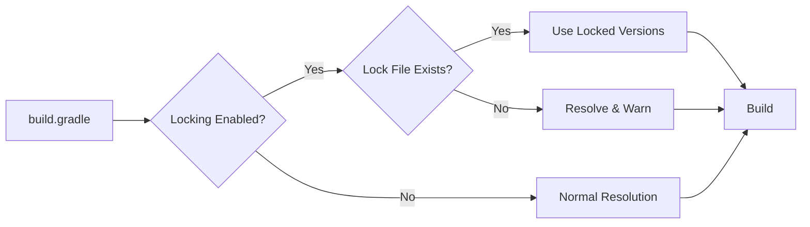

# Gradle Native Dependency Locking

Gradle's built-in dependency locking mechanism provides reproducible builds without requiring external plugins. Available since Gradle 4.8 and recommended for Gradle 9+ projects.

## Contents

- [Overview](#overview)
- [Never Edit Lockfiles Directly](#never-edit-lockfiles-directly)
- [Security and Dependabot Integration](#security-and-dependabot-integration)
- [When to Use Native vs Nebula](#when-to-use-native-vs-nebula)
- [Setup](#setup)
- [The resolveAndLockAll Task](#the-resolveandlockall-task)
- [Locking All Configurations](#locking-all-configurations)
- [Information Comparison: Native vs Nebula](#information-comparison-native-vs-nebula)
- [Lock File Format](#lock-file-format)
- [Generating Lock Files](#generating-lock-files)
- [Recommended Update Pattern: Delete and Regenerate](#recommended-update-pattern-delete-and-regenerate)
- [Targeted Updates](#targeted-updates)
- [Multi-Module Projects](#multi-module-projects)
- [Automated Validation](#automated-validation)
- [CI/CD Integration](#cicd-integration)
- [Lock Modes](#lock-modes)
- [Scope Attribution Issues](#scope-attribution-issues)
- [Troubleshooting](#troubleshooting)
- [Migration from Nebula](#migration-from-nebula)
- [Forces and Version Catalog](#forces-and-version-catalog)
- [Related](#related)

---
## Overview

Gradle native dependency locking captures the exact versions of all resolved dependencies in a `gradle.lockfile` per project. When locking is enabled, Gradle uses these locked versions instead of resolving dynamic versions.

### Key Benefits

| Benefit | Description |
|---------|-------------|
| **Zero Plugins** | Built into Gradle, no external dependencies |
| **Simple Format** | Human-readable text file, easy to diff |
| **Gradle 9 Native** | First-class support, no plugin compatibility concerns |
| **Single File** | One `gradle.lockfile` per project for all configurations |
| **Fast Resolution** | Skips version resolution when locks are valid |

### How It Works



## Never Edit Lockfiles Directly

> ⚠️ **CRITICAL RULE**: Never manually edit `gradle.lockfile` files. Always regenerate them using Gradle tasks.

### Why Manual Edits Are Forbidden

1. **Integrity**: Lockfiles are generated artifacts - manual edits break the source of truth
2. **Reproducibility**: Hand-edited entries may not match actual dependency resolution
3. **Validation**: Gradle validates lockfiles against resolved dependencies - mismatches cause build failures
4. **Maintenance**: Manual edits are overwritten on the next `--write-locks` run

### The Only Way to Update Lockfiles

```bash
# CORRECT: Always use Gradle tasks to regenerate
./gradlew resolveAndLockAll --write-locks --refresh-dependencies --no-daemon --no-scan

# CORRECT: Update specific dependencies
./gradlew dependencies --update-locks org.springframework:*

# WRONG: Never do this
# sed, vim, or any manual edit of gradle.lockfile
```

### What If I Need to Fix a Scope Issue?

For scope attribution issues (e.g., protobuf-javalite), do NOT manually edit the lockfile. Instead:

1. **Use LENIENT mode** for the affected module (see [Scope Attribution Issues](#scope-attribution-issues))
2. **Fix the root cause** in `build.gradle` (add explicit dependency, fix configuration)
3. **Regenerate lockfiles** after fixing

### Lockfile Header Warning

Every lockfile contains this header - respect it:

```text
# This is a Gradle generated file for dependency locking.
# Manual edits can break the build and are not advised.
# This file is expected to be part of source control.
```

## Security and Dependabot Integration

Lockfiles are essential for security visibility and Dependabot accuracy.

### Why Locking Matters for Security

| Aspect | Without Locking | With Locking |
|--------|-----------------|--------------|
| **Dependabot alerts** | May miss transitives | Sees exact locked versions |
| **Security audits** | Versions vary per build | Deterministic, auditable |
| **CVE verification** | Hard to confirm fix | `grep` lockfile for version |
| **CI dependency-review** | Resolves at build time | Uses locked versions |

### Security Update Workflow

When fixing a Dependabot vulnerability:

```bash
# 1. Check current locked version
grep "vulnerable-package" **/gradle.lockfile

# 2. Update version catalog with patched version
# Edit gradle/libs.versions.toml

# 3. Add force directive if needed (for transitives)
# Edit build.gradle - add to resolutionStrategy.force

# 4. Regenerate lockfiles
./gradlew resolveAndLockAll --write-locks --refresh-dependencies --no-daemon --no-scan

# 5. Verify fix is applied in lockfile
grep "vulnerable-package" **/gradle.lockfile
# Should show new patched version

# 6. Verify with dependency graph (second layer of verification)
./gradlew -I gradle/dependency-graph-init.gradle \
    :ForceDependencyResolutionPlugin_resolveAllDependencies
# Check the output matches the lockfile
```

### Dependency Graph as Verification Layer

The dependency graph plugin provides a **second layer of verification** on top of the lockfile. It shows what the build actually resolves, which should match what's locked.

| Tool | Purpose | Use Case |
|------|---------|----------|
| **Lockfile** | Source of truth for locked versions | Primary verification - `grep` for version |
| **Dependency Graph** | Verification layer | Confirms resolved versions match locks |
| **dependencyInsight** | Deep debugging | Trace why a version was selected |

### Verifying Security Fixes

After applying a security fix, use **both** lockfile and dependency graph to verify:

```bash
# PRIMARY: Check lockfile for patched version
grep "commons-compress" app/gradle.lockfile
# Expected: org.apache.commons:commons-compress:1.27.1=runtimeClasspath,...

# VERIFICATION: Run dependency graph to confirm resolution matches
./gradlew -I gradle/dependency-graph-init.gradle \
    :ForceDependencyResolutionPlugin_resolveAllDependencies

# Check dependency graph output matches lockfile
grep "commons-compress" build/reports/dependency-graph-snapshots/dependency-list.txt
# Should show same version as lockfile

# DEBUGGING: Use dependencyInsight if versions don't match
./gradlew :app:dependencyInsight --dependency commons-compress --configuration runtimeClasspath
```

### When Lockfile and Dependency Graph Differ

If the dependency graph shows a different version than the lockfile, investigate:

1. **Lockfile is stale** - Regenerate with `--write-locks`
2. **Configuration not locked** - Check if the configuration has locking enabled
3. **Scope attribution issue** - See [Scope Attribution Issues](#scope-attribution-issues)

### Related Security Documentation

- [Fix Strategies](.claude/skills/dependabot-security/references/fix-strategies.md) - Strategy hierarchy for vulnerability fixes
- [Dependency Graph](.claude/skills/dependabot-security/references/dependency-graph.md) - Dependency graph plugin setup
- [Severity Processing](.claude/skills/dependabot-security/references/severity-processing.md) - Process by severity order

## When to Use Native vs Nebula

**Native Gradle locking is the default recommendation** - it requires no additional plugins, has first-class Gradle support, and minimal configuration.

### Comparison

| Criteria | Native Gradle (Default) | Nebula Plugin (Alternative) |
|----------|------------------------|----------------------------|
| **Plugin required** | No (built-in) | Yes (`com.netflix.nebula.dependency-lock`) |
| **Gradle 9+ support** | First-class | Requires v16.1.0+ with plugin mapping |
| **Configuration** | 3 lines | Plugin setup + settings.gradle mapping |
| **Lock file format** | Text (single file, all configs) | JSON (per-config, shows transitives) |
| **File size** | ~3.4x smaller | Larger (per-config structure) |
| **Transitive tracking** | No | `firstLevelTransitive` shows sources |
| **Version conflicts visible** | Same artifact = multiple lines | Compare across config sections |
| **Project deps marked** | No | `"project": true` |
| **Partial updates** | `--update-locks group:artifact` | `updateLock` task with properties |
| **Resolution rules** | Use Gradle's native `resolutionStrategy` | Integrated with `resolution-rules` plugin |
| **diffLock equivalent** | `git diff gradle.lockfile` | `./gradlew diffLock` |

### Decision Guide

| Scenario | Recommendation |
|----------|----------------|
| **New projects** | **Native** (default, no plugins) |
| **Gradle 9+** | **Native** (first-class support) |
| **Minimal dependencies** | **Native** (simpler setup) |
| **Already using Nebula resolution-rules** | Nebula (tighter integration) |
| **Need transitive source tracking** | Nebula (JSON shows dep origins) |
| **Existing Nebula lock files** | Keep Nebula, migrate on major upgrade |

### Why Native is the Default

1. **Zero dependencies** - No plugin to maintain or upgrade
2. **No compatibility concerns** - Works with all Gradle versions 4.8+
3. **Simpler configuration** - Just 3 lines in `build.gradle`
4. **No plugin mapping** - No `settings.gradle` workarounds needed
5. **First-class support** - Gradle team maintains it directly

## Setup

### Basic Configuration

Add to your `build.gradle`:

```groovy
// build.gradle
dependencyLocking {
    lockAllConfigurations()
}
```

### Multi-Module Setup

For multi-module projects, apply to all subprojects:

```groovy
// root build.gradle
allprojects {
    dependencyLocking {
        lockAllConfigurations()
    }
}
```

### Selective Configuration Locking

Lock only specific configurations:

```groovy
dependencyLocking {
    lockAllConfigurations()
}

// Exclude configurations that shouldn't be locked
configurations {
    spotless {
        resolutionStrategy.deactivateDependencyLocking()
    }
    checkstyle {
        resolutionStrategy.deactivateDependencyLocking()
    }
}
```

### Custom Lock File Location

```groovy
dependencyLocking {
    lockAllConfigurations()
    lockFile = file("$projectDir/gradle/gradle.lockfile")
}
```

## The resolveAndLockAll Task

**CRITICAL**: The standard `./gradlew dependencies --write-locks` command may not resolve ALL configurations correctly. For complete and accurate lock file generation, use a custom `resolveAndLockAll` task.

### Why This Task Is Required

1. **Configuration Coverage**: Standard tasks may miss some configurations (e.g., `productionRuntimeClasspath`, custom configurations)
2. **Scope Attribution**: Without explicit resolution, dependencies may be attributed to wrong configurations
3. **Multi-Module Consistency**: Ensures all subprojects generate lockfiles

### Task Implementation

Add this to your root `build.gradle`:

```groovy
// Task to resolve ALL configurations and write locks
// Usage: ./gradlew resolveAndLockAll --write-locks --refresh-dependencies
tasks.register('resolveAndLockAll') {
    description = 'Resolves all resolvable configurations to generate complete lock files'
    group = 'dependency locking'
    notCompatibleWithConfigurationCache("Filters configurations at execution time")
    doFirst {
        assert gradle.startParameter.writeDependencyLocks :
            "$path must be run from the command line with the `--write-locks` flag"
    }
    doLast {
        allprojects { proj ->
            proj.configurations.findAll { it.canBeResolved }.each { conf ->
                logger.lifecycle("Resolving ${proj.name}:${conf.name}")
                conf.resolve()
            }
        }
    }
}
```

### Correct Lock Generation Command

**Always use this command for lock generation:**

```bash
./gradlew resolveAndLockAll --write-locks --refresh-dependencies --no-daemon --no-scan
```

| Flag | Purpose |
|------|---------|
| `--write-locks` | Enables lock file writing |
| `--refresh-dependencies` | Bypasses Gradle cache for fresh resolution |
| `--no-daemon` | Ensures fresh JVM for consistent resolution |
| `--no-scan` | Speeds up the build (optional) |

### Performance Tuning for Large Projects

For multi-module projects with 50+ modules, add parallelism and JVM heap tuning:

```bash
# Large project lock generation (50+ modules)
./gradlew resolveAndLockAll --write-locks --refresh-dependencies \
    --no-daemon --no-scan --parallel --max-workers=4 \
    -Dorg.gradle.jvmargs="-Xms2G -Xmx3G"
```

| Flag | Purpose |
|------|---------|
| `--parallel` | Resolves subprojects in parallel |
| `--max-workers=4` | Limits parallel threads (adjust to CPU cores) |
| `-Dorg.gradle.jvmargs="-Xms2G -Xmx3G"` | Sets initial and max JVM heap for large dependency graphs |

### Why `--refresh-dependencies` Is Recommended

Gradle caches dependency resolution. Using `--refresh-dependencies` ensures:

1. **Fresh resolution**: All dependencies are re-resolved from repositories
2. **Consistent lockfiles**: Avoids stale cached versions affecting results
3. **Latest versions**: Picks up any version changes in repositories

**Note**: `--refresh-dependencies` helps with freshness but does NOT fix scope attribution issues (see [Scope Attribution Issues](#scope-attribution-issues)).

## Locking All Configurations

### Why Lock Everything?

Bitso projects often have additional configurations beyond standard Java classpaths:
- `protobuf`, `compileProtoPath` (from protobuf-gradle-plugin)
- `productionRuntimeClasspath` (from Spring Boot)
- `jooqGenerator` (from jOOQ plugin)
- Custom configurations

With `lockAllConfigurations()`, all resolvable configurations are locked. The lockfile explicitly shows which version each configuration uses, making any version differences visible and reviewable.

### Version Differences Are Expected

Different configurations may resolve to different versions of the same dependency. This is normal and the lockfile makes it explicit:

```text
# Example: Different configs using different versions
com.bitso.aux:resilience-utils:2.0.0=compileClasspath,testCompileClasspath
com.bitso.aux:resilience-utils:2.0.1=runtimeClasspath,productionRuntimeClasspath
```

This transparency is a feature - you can see exactly what's happening and decide if you need to align versions using `resolutionStrategy.force()`.

### Locking Custom Configurations (Protobuf, gRPC, etc.)

`lockAllConfigurations()` automatically includes all resolvable configurations:

- `compileClasspath`, `runtimeClasspath`
- `testCompileClasspath`, `testRuntimeClasspath`
- `annotationProcessor`, `testAnnotationProcessor`
- `protobuf` (from protobuf-gradle-plugin)
- `jooqGenerator` (from jOOQ plugin)
- Any custom configurations you define

Verify all configurations are locked:

```bash
# Check what's in the lock file
cat gradle.lockfile | grep -E "=.*protobuf|=.*jooq" | head -5
```

Example output showing protobuf configs are locked:

```text
com.google.protobuf:protobuf-java:3.25.5=compileClasspath,protobuf,runtimeClasspath
io.grpc:grpc-protobuf:1.75.0=compileClasspath,protobuf,runtimeClasspath
```

### Exclude Tool Configurations

Some configurations shouldn't be locked (they're tools, not app deps):

```groovy
dependencyLocking {
    lockAllConfigurations()
}

configurations {
    // Tool configurations that don't need locking
    spotless {
        resolutionStrategy.deactivateDependencyLocking()
    }
    checkstyle {
        resolutionStrategy.deactivateDependencyLocking()
    }
    pmd {
        resolutionStrategy.deactivateDependencyLocking()
    }
}
```

## Information Comparison: Native vs Nebula

Both formats capture dependency versions, but with different information:

### Information Available in Both

| Information | Native | Nebula |
|-------------|--------|--------|
| Locked version | `artifact:version=configs` | `"locked": "version"` |
| Which configurations use dep | `=config1,config2` | Separate per-config sections |
| Version conflicts between configs | Yes (multiple lines) | Yes (different sections) |
| Project dependencies | Not marked | `"project": true` |

### Information Only in Nebula

| Information | Example |
|-------------|---------|
| **Transitive sources** | `"firstLevelTransitive": ["spring-boot-starter"]` |
| **Requested version** | `"requested": "3.5.9"` (when explicitly declared) |
| **Resolution rules applied** | `"viaResolutionRule": true` |

### Information Only in Native

| Information | Example |
|-------------|---------|
| **Compact multi-config** | Single line shows ALL configs using that version |
| **Easy conflict detection** | Same artifact with different versions = multiple lines |

### Example: Version Conflict Detection

**Native format** - easy to spot conflicts (same artifact, different versions):

```text
com.bitso.aux:resilience-utils:2.0.0=compileClasspath,testCompileClasspath
com.bitso.aux:resilience-utils:2.0.1=runtimeClasspath,testRuntimeClasspath
```

**Nebula format** - requires comparing across sections:

```json
{
    "compileClasspath": {
        "com.bitso.aux:resilience-utils": { "locked": "2.0.0" }
    },
    "runtimeClasspath": {
        "com.bitso.aux:resilience-utils": { "locked": "2.0.1" }
    }
}
```

### Transitive Tracking with Dependency Graph Plugin

Nebula's `firstLevelTransitive` field shows which dependency brought in a transitive. With native locking, you get the same capability using Gradle's built-in tools:

**Use `dependencyInsight` for quick checks:**

```bash
# Find why a dependency appears and which version was selected
./gradlew :module:dependencyInsight --dependency commons-compress --configuration runtimeClasspath
```

**Use the dependency graph plugin for full visibility:**

```bash
# Generate complete dependency graph (same as CI uses)
./gradlew -I gradle/dependency-graph-init.gradle \
    :ForceDependencyResolutionPlugin_resolveAllDependencies

# Find all versions of a package across configurations
grep -i "commons-compress" build/reports/dependency-graph-snapshots/dependency-list.txt

# Find which configuration/dependency brings a specific version
grep -B5 "commons-compress:1.23" build/reports/dependency-graph-snapshots/dependency-graph.json
```

**Native locking + dependency graph = full visibility:**

| Need | Tool |
|------|------|
| What exact versions are locked? | `gradle.lockfile` |
| Why does this version appear? | `./gradlew dependencyInsight` |
| What does CI see? | `dependency-graph-init.gradle` |
| Which config brings old version? | `grep` in `dependency-graph.json` |

See [Dependency Graph Setup](.claude/skills/dependabot-security/references/dependency-graph.md) for full setup instructions.

## Lock File Format

The native lock file is a simple text format:

```text
# This is a Gradle generated file for dependency locking.
# Manual edits can break the build and are not advised.
# This file is expected to be part of source control.
com.fasterxml.jackson.core:jackson-annotations:2.19.4=compileClasspath,runtimeClasspath
com.fasterxml.jackson.core:jackson-core:2.19.4=compileClasspath,runtimeClasspath
com.fasterxml.jackson.core:jackson-databind:2.19.4=compileClasspath,runtimeClasspath
org.springframework.boot:spring-boot-dependencies:3.5.9=compileClasspath,runtimeClasspath
empty=annotationProcessor
```

### Format Details

| Component | Description |
|-----------|-------------|
| `group:artifact:version` | The locked dependency coordinate |
| `=configurations` | Comma-separated list of configurations using this version |
| `empty=configuration` | Marks configurations with no dependencies |
| Lines starting with `#` | Comments (auto-generated header) |

### Comparison with Nebula Format

**Native (gradle.lockfile)**:

```text
org.springframework:spring-core:6.2.14=compileClasspath,runtimeClasspath
```

**Nebula (dependencies.lock)**:

```json
{
    "compileClasspath": {
        "org.springframework:spring-core": {
            "locked": "6.2.14",
            "transitive": ["org.springframework.boot:spring-boot-starter"]
        }
    }
}
```

## Generating Lock Files

### Initial Generation (Recommended)

**Use the delete-and-regenerate pattern for accurate, clean lock generation:**

```bash
# RECOMMENDED: Delete existing lockfiles and regenerate from scratch
find . -name "gradle.lockfile" -type f -delete
./gradlew resolveAndLockAll --write-locks --refresh-dependencies --no-daemon --no-scan
```

For large multi-module projects (50+ modules), add parallelism:

```bash
find . -name "gradle.lockfile" -type f -delete
./gradlew resolveAndLockAll --write-locks --refresh-dependencies \
    --no-daemon --no-scan --parallel --max-workers=4
```

See [Recommended Update Pattern: Delete and Regenerate](#recommended-update-pattern-delete-and-regenerate) for why this is the preferred approach.

### Alternative Commands

```bash
# Quick generation (may have scope issues)
./gradlew build --write-locks -x test

# Root project only (NOT recommended for multi-module)
./gradlew dependencies --write-locks

# Specific project
./gradlew :my-module:dependencies --write-locks

# Specific configuration
./gradlew dependencies --configuration compileClasspath --write-locks
```

> **WARNING**: The `dependencies` task and `build --write-locks` may not capture all configurations correctly.
> Always use `resolveAndLockAll --refresh-dependencies` for production lock generation.

### Verify Lock Files Exist

After generation, verify:

```bash
find . -name "gradle.lockfile" -type f
```

Expected output shows one file per project with dependencies:

```text
./app/gradle.lockfile
./core/gradle.lockfile
./api/gradle.lockfile
```

### Commit Lock Files

```bash
git add "**/gradle.lockfile"
git commit -m "chore: add Gradle native dependency lock files"
```

## Recommended Update Pattern: Delete and Regenerate

The safest and most reliable way to update lockfiles is to **delete all existing lockfiles first, then regenerate from scratch**. This is the recommended approach for all lockfile updates.

### Why Delete First?

| Reason | Description |
|--------|-------------|
| **Eliminates stale entries** | Removed dependencies or modules leave orphaned entries in lockfiles |
| **Avoids scope attribution drift** | Incremental updates accumulate configuration misattributions over time |
| **Reflects current state** | Lockfiles match the *current* build configuration, not historical artifacts |
| **Prevents cached resolution issues** | Stale Gradle cache cannot affect fresh generation |
| **Clean diffs** | `git diff` shows exactly what changed with no noise from stale entries |

### The Pattern

```bash
# Step 1: Delete ALL existing lockfiles
find . -name "gradle.lockfile" -type f -delete

# Step 2: Regenerate fresh from current dependency state
./gradlew resolveAndLockAll --write-locks --refresh-dependencies --no-daemon --no-scan

# Step 3: Verify coverage (lockfiles should approximate build.gradle count)
lockfiles=$(find . -name "gradle.lockfile" -type f | wc -l)
buildfiles=$(find . -name "build.gradle" -type f | wc -l)
echo "Lockfiles: $lockfiles / Build files: $buildfiles"

# Step 4: Review changes before committing
git diff --stat "**/gradle.lockfile"

# Step 5: Commit
git add "**/gradle.lockfile"
git commit -m "chore: regenerate Gradle dependency lock files"
```

For large multi-module projects (50+ modules):

```bash
find . -name "gradle.lockfile" -type f -delete
./gradlew resolveAndLockAll --write-locks --refresh-dependencies \
    --no-daemon --no-scan --parallel --max-workers=4 \
    -Dorg.gradle.jvmargs="-Xms2G -Xmx3G"
```

### When to Use This Pattern

- **Routine dependency updates** (version catalog changes, BOM upgrades)
- **Adding or removing modules** in a multi-module project
- **After merge conflicts** in lockfiles
- **Periodic maintenance** (weekly/monthly lock refresh)
- **Initial lock generation** when enabling locking for the first time
- **After changing `resolutionStrategy`** (force directives, substitutions)

### Checking for Downgrades

After regenerating, always check that security-critical dependencies were not downgraded:

```bash
# Check for version changes (- is old, + is new)
git diff -- "**/gradle.lockfile" | grep "^[-+]" | grep -v "^---\|^+++"

# Example of a DOWNGRADE to watch for:
# -commons-beanutils:commons-beanutils:1.11.0=...
# +commons-beanutils:commons-beanutils:1.9.4=...  # BAD - security regression!
```

If you see downgrades in security-sensitive dependencies, verify your `resolutionStrategy.force` directives are still in place. See [Forces and Version Catalog](#forces-and-version-catalog).

## Targeted Updates

For surgical updates to specific dependencies (e.g., a single security fix where you want a minimal diff), use Gradle's `--update-locks` flag instead of the full delete-and-regenerate pattern.

### Update Specific Dependencies

```bash
# Update a single dependency
./gradlew dependencies --update-locks org.springframework:spring-core

# Update all dependencies in a group
./gradlew dependencies --update-locks org.springframework:*

# Update multiple dependencies
./gradlew dependencies --update-locks org.springframework:spring-core,com.fasterxml.jackson.core:jackson-databind
```

### Update for Specific Configuration

```bash
./gradlew dependencies --configuration runtimeClasspath --update-locks org.springframework:*
```

### When to Use Targeted Updates

- **Single security fix** where you want to see only that dependency change in the diff
- **Reviewing a specific upgrade** where a minimal diff aids code review

> **Note**: Targeted updates are convenient but can leave stale entries or scope attribution drift. Prefer delete-and-regenerate for routine updates.

### View Dependency Changes

Before committing, diff the lock file:

```bash
git diff gradle.lockfile
```

Example output:

```diff
-org.springframework:spring-core:6.2.13=compileClasspath,runtimeClasspath
+org.springframework:spring-core:6.2.14=compileClasspath,runtimeClasspath
```

## Multi-Module Projects

Multi-module Gradle projects require **one lockfile per subproject** that has dependencies. This is critical for reproducible builds.

### Per-Project Lock Files (Default)

Each project gets its own `gradle.lockfile`:

```text
my-app/
├── gradle.lockfile                              # Root project (jacoco, buildscript)
├── bitso-libs/
│   ├── domain/
│   │   └── gradle.lockfile                      # Domain module locks
│   ├── api/
│   │   └── gradle.lockfile                      # API module locks
│   ├── persistence/
│   │   └── gradle.lockfile                      # Persistence module locks
│   └── shared/
│       ├── protobuf/
│       │   └── gradle.lockfile                  # Proto dependencies
│       └── grpc-client/
│           └── gradle.lockfile                  # gRPC client locks
└── bitso-services/
    └── my-service/
        └── gradle.lockfile                      # Service module (deployable)
```

### CRITICAL: `dependencies --write-locks` Only Generates for ROOT

The command `./gradlew dependencies --write-locks` **only generates a lockfile for the root project**. To generate lockfiles for ALL submodules, you must use one of these approaches:

#### Approach 1: Use `resolveAndLockAll` (Recommended)

The custom `resolveAndLockAll` task explicitly resolves every resolvable configuration across all subprojects. Combined with the delete-and-regenerate pattern, this is the safest approach:

```bash
# Delete stale lockfiles and regenerate from scratch
find . -name "gradle.lockfile" -type f -delete
./gradlew resolveAndLockAll --write-locks --refresh-dependencies \
    --no-daemon --no-scan --parallel --max-workers=4

# Verify lockfiles were created
find . -name "gradle.lockfile" -type f | wc -l
```

See [The resolveAndLockAll Task](#the-resolveandlockall-task) for how to add this task to your build.

#### Approach 2: Use `build --write-locks` (Alternative)

The build task also resolves all configurations across all subprojects:

```bash
# Generate lockfiles for ALL submodules in one command
./gradlew build --write-locks -x test

# Verify lockfiles were created
find . -name "gradle.lockfile" -type f | wc -l
```

This works because `build` triggers dependency resolution for every subproject, and `--write-locks` captures all resolved versions. However, `resolveAndLockAll` is preferred because it explicitly resolves ALL configurations without requiring test exclusions.

#### Approach 4: Explicit Subproject Dependencies (When Build Fails)

If the build fails (e.g., proto compilation issues), generate lockfiles for each subproject explicitly:

```bash
# Generate for root + specific subprojects
./gradlew dependencies --write-locks \
  :bitso-services:my-service:dependencies --write-locks \
  :bitso-libs:domain:dependencies --write-locks \
  :bitso-libs:api:dependencies --write-locks \
  :bitso-libs:persistence:dependencies --write-locks
```

List all projects first to identify what needs locking:

```bash
./gradlew projects --quiet | grep "Project"
```

#### Approach 5: Custom Task for All Subprojects

Add to root `build.gradle`:

```groovy
tasks.register('writeAllLocks') {
    description = 'Generate lock files for all subprojects'
    dependsOn subprojects.collect { "${it.path}:dependencies" }
}

// Run with: ./gradlew writeAllLocks --write-locks
```

### Expected Lockfile Count

**Rule of thumb**: Number of lockfiles should equal or closely match number of `build.gradle` files.

| Module Type | Has Lockfile? | Notes |
|-------------|---------------|-------|
| Root project | Yes | Jacoco, buildscript dependencies |
| Service modules (`bitso-services/*`) | **Yes** | Critical - deployable artifact |
| Library modules (`bitso-libs/*`) | **Yes** | Published/shared dependencies |
| Protobuf modules | Sometimes | Only if has Java dependencies beyond proto compiler |
| Empty parent modules | No | Aggregate modules with no deps |

### Validation: Lockfile Coverage Check

**Always verify lockfile coverage after enabling locking:**

```bash
# Count lockfiles vs build.gradle files
lockfiles=$(find . -name "gradle.lockfile" -type f | wc -l)
buildfiles=$(find . -name "build.gradle" -type f | wc -l)
echo "Lockfiles: $lockfiles / Build.gradle files: $buildfiles"

# Acceptable if lockfiles >= buildfiles - (number of empty/proto modules)
```

### Common Multi-Module Issues

#### Issue: Only 2 lockfiles in a 10+ module project

**Cause**: Used `dependencies --write-locks` which only generates for root.

**Solution**: Use `resolveAndLockAll --write-locks` instead (see [Approach 1](#approach-1-use-resolveandlockall-recommended)).

#### Issue: Lockfiles missing for some subprojects

**Cause**: Build failed before resolving those subprojects.

**Solution**: Generate explicitly for each subproject (see Approach 4).

#### Issue: Protobuf module has no lockfile

**Cause**: Protobuf modules often have no Java dependencies to lock (just proto compilation).

**Acceptable**: If the module only has `protobuf` and `compileProtoPath` configurations with no `implementation`/`api` dependencies.

### Centralized Lock File (Alternative)

For monorepo-style projects, centralize locks:

```groovy
// root build.gradle
allprojects {
    dependencyLocking {
        lockAllConfigurations()
        lockFile = rootProject.file("gradle/locks/${project.path.replace(':', '/')}/gradle.lockfile")
    }
}
```

## Automated Validation

### Lockfile Coverage Validation Script

Add this script to validate lockfile coverage in your project:

```bash
#!/bin/bash
# scripts/validate-lockfiles.sh
# Validates that all submodules have gradle.lockfile

set -e

echo "=== Gradle Lockfile Coverage Validation ==="

# Count files
lockfiles=$(find . -name "gradle.lockfile" -type f | wc -l | tr -d ' ')
buildfiles=$(find . -name "build.gradle" -type f | wc -l | tr -d ' ')

echo "Lockfiles found: $lockfiles"
echo "Build.gradle files: $buildfiles"

# Find missing lockfiles
missing=0
echo ""
echo "Checking for missing lockfiles..."

for dir in $(find . -name "build.gradle" -type f -exec dirname {} \;); do
    if [ ! -f "$dir/gradle.lockfile" ]; then
        # Check if it's a parent/aggregate module (has subprojects but no deps)
        if grep -q "dependencies {" "$dir/build.gradle" 2>/dev/null; then
            echo "MISSING: $dir/gradle.lockfile (has dependencies block)"
            missing=$((missing + 1))
        else
            echo "SKIPPED: $dir (no dependencies block - aggregate module)"
        fi
    fi
done

echo ""
if [ $missing -gt 0 ]; then
    echo "ERROR: $missing lockfiles missing!"
    echo ""
    echo "To fix, run delete-and-regenerate:"
    echo "  find . -name 'gradle.lockfile' -type f -delete"
    echo "  ./gradlew resolveAndLockAll --write-locks --refresh-dependencies --no-daemon --no-scan --parallel"
    echo ""
    echo "Or for specific modules:"
    echo "  ./gradlew :module:path:dependencies --write-locks"
    exit 1
else
    echo "SUCCESS: All modules with dependencies have lockfiles"
fi
```

### Pre-Commit Hook Integration

Add to `.git/hooks/pre-commit` or use with Husky/pre-commit framework:

```bash
#!/bin/bash
# Validate lockfiles exist for all modules before commit

if git diff --cached --name-only | grep -q "build.gradle"; then
    echo "Build files changed - validating lockfiles..."

    # Check if any new build.gradle was added without lockfile
    for file in $(git diff --cached --name-only | grep "build.gradle$"); do
        dir=$(dirname "$file")
        if [ ! -f "$dir/gradle.lockfile" ]; then
            if grep -q "dependencies {" "$file" 2>/dev/null; then
                echo "ERROR: $file added but missing $dir/gradle.lockfile"
                echo "Run: ./gradlew resolveAndLockAll --write-locks --refresh-dependencies --no-daemon --no-scan --parallel"
                exit 1
            fi
        fi
    done
fi
```

### CI Validation (Complete)

```bash
#!/bin/bash
# CI script: scripts/ci-validate-lockfiles.sh
# Validates lockfiles are present AND up-to-date

set -e

echo "=== Step 1: Verify lockfile coverage ==="
./scripts/validate-lockfiles.sh

echo ""
echo "=== Step 2: Verify lockfiles are up-to-date ==="
# Delete and regenerate to check for drift
find . -name "gradle.lockfile" -type f -exec cp {} {}.bak \;
find . -name "gradle.lockfile" -type f -not -name "*.bak" -delete
./gradlew resolveAndLockAll --write-locks --refresh-dependencies --no-daemon --no-scan

if ! git diff --quiet "**/gradle.lockfile"; then
    echo "ERROR: Lockfiles are out of date!"
    echo ""
    echo "Changed files:"
    git diff --name-only "**/gradle.lockfile"
    echo ""
    echo "Diff:"
    git diff "**/gradle.lockfile" | head -50
    echo ""
    echo "To fix: delete all lockfiles and regenerate with resolveAndLockAll"
    exit 1
fi

# Clean up backup files
find . -name "gradle.lockfile.bak" -type f -delete

echo ""
echo "SUCCESS: All lockfiles present and up-to-date"
```

## CI/CD Integration

### GitHub Actions

```yaml
name: Build

on: [push, pull_request]

jobs:
  build:
    runs-on: ubuntu-latest
    steps:
      - uses: actions/checkout@v4

      - name: Setup Java
        uses: actions/setup-java@v4
        with:
          java-version: '21'
          distribution: 'temurin'

      - name: Build with locked dependencies
        run: ./gradlew build

      - name: Verify lockfile coverage
        run: |
          # Count and compare
          lockfiles=$(find . -name "gradle.lockfile" -type f | wc -l)
          buildfiles=$(find . -name "build.gradle" -type f | wc -l)
          echo "Lockfiles: $lockfiles / Build files: $buildfiles"

          # Check for missing (modules with deps but no lockfile)
          for dir in $(find . -name "build.gradle" -exec dirname {} \;); do
            if [ ! -f "$dir/gradle.lockfile" ]; then
              if grep -q "dependencies {" "$dir/build.gradle" 2>/dev/null; then
                echo "::error::Missing lockfile: $dir/gradle.lockfile"
                exit 1
              fi
            fi
          done

      - name: Verify lock files are up to date
        run: |
          find . -name "gradle.lockfile" -type f -delete
          ./gradlew resolveAndLockAll --write-locks --refresh-dependencies --no-daemon --no-scan --parallel
          if ! git diff --quiet "**/gradle.lockfile"; then
            echo "::error::Lock files are out of date. Run delete-and-regenerate locally and commit."
            git diff --stat "**/gradle.lockfile"
            exit 1
          fi
```

### Jenkins Pipeline

```groovy
pipeline {
    stages {
        stage('Build') {
            steps {
                sh './gradlew build'
            }
        }
        stage('Verify Lockfile Coverage') {
            steps {
                sh '''
                    lockfiles=$(find . -name "gradle.lockfile" -type f | wc -l)
                    buildfiles=$(find . -name "build.gradle" -type f | wc -l)
                    echo "Lockfiles: $lockfiles / Build files: $buildfiles"
                '''
            }
        }
        stage('Verify Locks Up-to-Date') {
            steps {
                sh 'find . -name "gradle.lockfile" -type f -delete'
                sh './gradlew resolveAndLockAll --write-locks --refresh-dependencies --no-daemon --no-scan --parallel'
                sh 'git diff --exit-code "**/gradle.lockfile"'
            }
        }
    }
}
```

## Lock Modes

Gradle supports different lock modes for flexibility:

### STRICT Mode (Default)

Fails if a dependency is not in the lock file:

```groovy
dependencyLocking {
    lockAllConfigurations()
    lockMode = LockMode.STRICT
}
```

### LENIENT Mode

Allows unlocked dependencies (useful for testing new deps):

```groovy
dependencyLocking {
    lockAllConfigurations()
    lockMode = LockMode.LENIENT
}
```

### Runtime Mode Selection

```bash
# Build in lenient mode (for testing)
./gradlew build -PdependencyLocking.lockMode=lenient

# Build in strict mode (default for CI)
./gradlew build -PdependencyLocking.lockMode=strict
```

### Configuration

```groovy
// build.gradle
def lockMode = project.hasProperty('dependencyLocking.lockMode')
    ? LockMode.valueOf(project.property('dependencyLocking.lockMode').toString().toUpperCase())
    : LockMode.STRICT

dependencyLocking {
    lockAllConfigurations()
    lockMode = lockMode
}
```

## Scope Attribution Issues

### The Problem

Even with `--refresh-dependencies`, some transitive dependencies may be attributed to only a subset of configurations. This is a known limitation of Gradle Native locking.

### Symptoms

Build fails with:

```
Execution failed for task ':bitso-services:my-service:bootJar'.
> Resolved 'com.google.protobuf:protobuf-javalite:3.25.8' which is not part of the dependency lock state
```

### Root Cause

1. Spring Boot creates both `runtimeClasspath` and `productionRuntimeClasspath` configurations
2. `bootJar` task uses `runtimeClasspath`
3. Lock generation may attribute the transitive dependency only to `productionRuntimeClasspath`
4. When `bootJar` runs, the dependency is not found in the lock for `runtimeClasspath`

### Diagnosis

Check the lockfile for the problematic dependency:

```bash
# Find the dependency in the lockfile
grep "protobuf-javalite" bitso-services/my-service/gradle.lockfile

# Expected (correct):
# com.google.protobuf:protobuf-javalite:3.25.8=productionRuntimeClasspath,runtimeClasspath

# Problematic (scope issue):
# com.google.protobuf:protobuf-javalite:3.25.8=productionRuntimeClasspath
```

### Solution: LENIENT Mode for Affected Modules

When scope attribution cannot be fixed, apply LENIENT mode **only to the affected module**:

```groovy
// bitso-services/my-service/build.gradle

// WORKAROUND: Native Gradle locking scope attribution issue
// This allows the build to succeed when a transitive dependency
// is missing from a configuration's lock entry.
dependencyLocking {
    lockMode = LockMode.LENIENT
}
```

### LENIENT Mode Trade-offs

| Aspect | Impact |
|--------|--------|
| **Build success** | ✅ Build will succeed |
| **Locked dependencies** | ✅ Still verified against lockfile |
| **Unlocked transitives** | ⚠️ Allowed without verification |
| **Reproducibility** | ⚠️ Slightly reduced for missing entries |

### Best Practices

1. **Apply LENIENT only where needed**: Don't apply globally
2. **Document the workaround**: Add a comment explaining why
3. **Monitor for fixes**: Gradle may fix this in future versions
4. **Verify with dependency graph**: Ensure versions are still correct

```bash
# PRIMARY: Run dependency graph to verify resolved versions
./gradlew -I gradle/dependency-graph-init.gradle \
    :ForceDependencyResolutionPlugin_resolveAllDependencies

# Check the output for the dependency
grep "protobuf-javalite" build/reports/dependency-graph-snapshots/dependency-list.txt

# DEBUGGING: Use dependencyInsight to trace why a version was selected
./gradlew :bitso-services:my-service:dependencyInsight \
    --dependency protobuf-javalite \
    --configuration runtimeClasspath
```

## Troubleshooting

### Lock File Out of Sync

**Symptom**: Build fails with version mismatch.

**Solution**: Use the [delete-and-regenerate pattern](#recommended-update-pattern-delete-and-regenerate):

```bash
find . -name "gradle.lockfile" -type f -delete
./gradlew resolveAndLockAll --write-locks --refresh-dependencies --no-daemon --no-scan
git add "**/gradle.lockfile"
git commit -m "chore: regenerate dependency lock files"
```

### Missing Dependencies in Lock File

**Symptom**: Error about dependency not being locked.

**Solution**: Use the [delete-and-regenerate pattern](#recommended-update-pattern-delete-and-regenerate):

```bash
find . -name "gradle.lockfile" -type f -delete
./gradlew resolveAndLockAll --write-locks --refresh-dependencies --no-daemon --no-scan
```

### Spring Boot bootJar Fails with "not part of dependency lock state"

**Symptom**: `bootJar` task fails with error like:
```
Resolved 'com.google.protobuf:protobuf-javalite:3.25.8' which is not part of the dependency lock state
```

**Root Cause**: This is a **scope attribution issue** in Gradle Native locking. The dependency is captured for `productionRuntimeClasspath` but not `runtimeClasspath` (which `bootJar` uses). This is a known limitation that cannot be fixed by regenerating locks.

**Solution (Recommended)**: Apply LENIENT mode to the affected service module:

```groovy
// bitso-services/my-service/build.gradle

// WORKAROUND: Native Gradle locking scope attribution issue
// The protobuf-javalite transitive is attributed to productionRuntimeClasspath
// but not runtimeClasspath, causing bootJar to fail in STRICT mode.
dependencyLocking {
    lockMode = LockMode.LENIENT
}
```

**Important**: Regenerating locks with `--refresh-dependencies` does NOT fix this issue. The scope attribution problem is a limitation of Gradle Native locking.

> **WARNING**: Never manually edit lockfiles. See [Never Edit Lockfiles Directly](#never-edit-lockfiles-directly).

See [Scope Attribution Issues](#scope-attribution-issues) for detailed explanation.

### Lock File Merge Conflicts

**Symptom**: Git merge conflict in `gradle.lockfile`.

**Solution**: Use [delete-and-regenerate](#recommended-update-pattern-delete-and-regenerate) -- do not try to manually resolve lockfile conflicts:

```bash
# Delete conflicted lockfiles and regenerate
find . -name "gradle.lockfile" -type f -delete
./gradlew resolveAndLockAll --write-locks --refresh-dependencies --no-daemon --no-scan
git add "**/gradle.lockfile"
```

### Configuration Not Locked

**Symptom**: Some configurations resolve dynamically.

**Debug**:

```bash
./gradlew dependencies --configuration <config-name> --write-locks
```

### Disable Locking Temporarily

```bash
# For a single build (Gradle 8.7+)
./gradlew build -PdependencyLocking.lockMode=lenient
```

## Migration from Nebula

If you're using Nebula dependency-lock plugin, migrate to native:

### Step 1: Enable Native Locking

```groovy
// build.gradle - add alongside existing Nebula plugin
dependencyLocking {
    lockAllConfigurations()
}
```

### Step 2: Generate Native Lock Files

```bash
./gradlew dependencies --write-locks
```

### Step 3: Verify Builds Pass

```bash
./gradlew clean build
```

### Step 4: Remove Nebula Plugin

```groovy
// build.gradle - remove
// plugins {
//     id 'com.netflix.nebula.dependency-lock'
// }

// settings.gradle - remove resolutionStrategy for dependency-lock
```

### Step 5: Delete Nebula Lock Files

```bash
find . -name "dependencies.lock" -type f -delete
```

### Step 6: Commit

```bash
git add "**/gradle.lockfile"
git rm "**/dependencies.lock"
git commit -m "chore: migrate from Nebula to native dependency locking"
```

## Forces and Version Catalog

Forces are still required even with native locking when security versions are higher than transitive dependencies would resolve to.

### Why Forces Are Still Needed

**Critical insight**: Lockfiles capture resolved versions, but if you remove forces and regenerate lockfiles, transitive dependencies may pull in LOWER versions than your security requirements.

```groovy
// WITHOUT force - DANGEROUS: transitive dependencies may downgrade
// commons-lang3 from BOM = 3.17.0, but security requires 3.18.0
// Lockfile will capture 3.17.0, silently violating security requirements

// WITH force - SAFE: security version is enforced
configurations.configureEach {
    resolutionStrategy {
        force libs.commons.lang3  // 3.18.0 from catalog
    }
}
```

### Correct Pattern: Centralize in Catalog + Keep Forces

```toml
# gradle/libs.versions.toml - Centralize versions here
[versions]
commons-lang3 = '3.18.0'       # Higher than BOM's 3.17.0
commons-compress = '1.27.1'
commons-beanutils = '1.11.0'
commons-logging = '1.3.5'

[libraries]
commons-lang3 = { module = 'org.apache.commons:commons-lang3', version.ref = 'commons-lang3' }
commons-compress = { module = 'org.apache.commons:commons-compress', version.ref = 'commons-compress' }
commons-beanutils = { module = 'commons-beanutils:commons-beanutils', version.ref = 'commons-beanutils' }
commons-logging = { module = 'commons-logging:commons-logging', version.ref = 'commons-logging' }
```

```groovy
// build.gradle - Keep forces, but reference catalog
allprojects {
    configurations.configureEach {
        resolutionStrategy {
            // Force security versions from catalog to prevent transitive downgrades
            force libs.commons.lang3
            force libs.commons.compress
            force libs.commons.beanutils
            force libs.commons.logging

            // Module substitutions (for replacing vulnerable modules)
            dependencySubstitution {
                substitute module("software.amazon.ion:ion-java")
                    using module("com.amazon.ion:ion-java:1.11.4")
            }
        }
    }
}
```

### What to Keep vs What to Centralize

| Keep in build.gradle | Move to Version Catalog |
|---------------------|------------------------|
| `force libs.xxx` statements | Version numbers |
| `dependencySubstitution` rules | Library coordinates |
| `eachDependency` for group replacements | - |
| `exclude` for module conflicts | - |

### What NOT to Remove

Do NOT remove forces just because versions are in the catalog. The catalog centralizes version numbers, but forces ensure those versions are actually used.

### Verification: Check for Downgrades

Always verify lockfile changes don't introduce downgrades:

```bash
# 1. Before making changes, save baseline
git stash

# 2. Make changes to build.gradle

# 3. Regenerate lockfiles
./gradlew dependencies --write-locks

# 4. Check for downgrades (lines starting with - are old, + are new)
git diff -- "*.lockfile" | grep "^[-+]" | grep -v "^---\|^+++"

# 5. If any security dependencies have LOWER versions, restore forces
# Example of a DOWNGRADE to avoid:
# -commons-beanutils:commons-beanutils:1.11.0=...
# +commons-beanutils:commons-beanutils:1.9.4=...  # BAD!
```

### When Forces Can Be Removed

Forces can be removed ONLY when:
1. The dependency is managed by a BOM (e.g., Spring Boot) AND
2. The BOM version meets or exceeds security requirements AND
3. The dependency is not transitively pulled from other sources at lower versions

Example where force is NOT needed:

```groovy
// logback managed by Spring Boot BOM 3.5.9 = 1.5.21
// Security requirement = 1.5.19
// 1.5.21 > 1.5.19, so no force needed - BOM handles it
```

## Related

- [Nebula Resolution Rules](https://github.com/nebula-plugins/gradle-resolution-rules-plugin) - Resolution rules for alignment and substitution
- [Gradle 9 Upgrade](.claude/skills/gradle-9/SKILL.md) - Gradle 9 migration guide
- [Gradle Official Docs](https://docs.gradle.org/current/userguide/dependency_locking.html) - Gradle dependency locking documentation
<!-- AUTO-GENERATED FILE - DO NOT EDIT DIRECTLY -->
<!-- Source: bitsoex/ai-code-instructions → java/skills/gradle-standards/references/native-dependency-locking.md -->
<!-- To modify, edit the source file and run the distribution workflow -->

