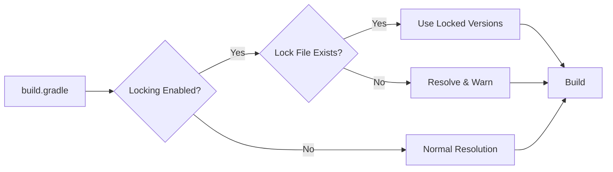

# Gradle Native Dependency Locking

Gradle's built-in dependency locking mechanism provides reproducible builds without requiring external plugins. Available since Gradle 4.8 and recommended for Gradle 9+ projects.

## Contents

- [Overview](#overview) (L30-L57)
- [When to Use Native vs Nebula](#when-to-use-native-vs-nebula) (L58-L96)
- [Setup](#setup) (L97-L151)
- [Locking All Configurations](#locking-all-configurations) (L152-L223)
- [Information Comparison: Native vs Nebula](#information-comparison-native-vs-nebula) (L224-L309)
- [Lock File Format](#lock-file-format) (L310-L354)
- [Generating Lock Files](#generating-lock-files) (L355-L400)
- [Updating Dependencies](#updating-dependencies) (L401-L446)
- [Multi-Module Projects](#multi-module-projects) (L447-L583)
- [Automated Validation](#automated-validation) (L584-L695)
- [CI/CD Integration](#cicd-integration) (L696-L775)
- [Lock Modes](#lock-modes) (L776-L825)
- [Troubleshooting](#troubleshooting) (L826-L912)
- [Migration from Nebula](#migration-from-nebula) (L913-L962)
- [Forces and Version Catalog](#forces-and-version-catalog) (L963-L1071)
- [Related](#related) (L1072-L1076)

---
## Overview

Gradle native dependency locking captures the exact versions of all resolved dependencies in a `gradle.lockfile` per project. When locking is enabled, Gradle uses these locked versions instead of resolving dynamic versions.

### Key Benefits

| Benefit | Description |
|---------|-------------|
| **Zero Plugins** | Built into Gradle, no external dependencies |
| **Simple Format** | Human-readable text file, easy to diff |
| **Gradle 9 Native** | First-class support, no plugin compatibility concerns |
| **Single File** | One `gradle.lockfile` per project for all configurations |
| **Fast Resolution** | Skips version resolution when locks are valid |

### How It Works


```mermaid
flowchart LR
    A[build.gradle] --> B{Locking Enabled?}
    B -->|Yes| C{Lock File Exists?}
    B -->|No| D[Normal Resolution]
    C -->|Yes| E[Use Locked Versions]
    C -->|No| F[Resolve & Warn]
    E --> G[Build]
    F --> G
    D --> G
```

## When to Use Native vs Nebula

**Native Gradle locking is the default recommendation** - it requires no additional plugins, has first-class Gradle support, and minimal configuration.

### Comparison

| Criteria | Native Gradle (Default) | Nebula Plugin (Alternative) |
|----------|------------------------|----------------------------|
| **Plugin required** | No (built-in) | Yes (`com.netflix.nebula.dependency-lock`) |
| **Gradle 9+ support** | First-class | Requires v16.1.0+ with plugin mapping |
| **Configuration** | 3 lines | Plugin setup + settings.gradle mapping |
| **Lock file format** | Text (single file, all configs) | JSON (per-config, shows transitives) |
| **File size** | ~3.4x smaller | Larger (per-config structure) |
| **Transitive tracking** | No | `firstLevelTransitive` shows sources |
| **Version conflicts visible** | Same artifact = multiple lines | Compare across config sections |
| **Project deps marked** | No | `"project": true` |
| **Partial updates** | `--update-locks group:artifact` | `updateLock` task with properties |
| **Resolution rules** | Use Gradle's native `resolutionStrategy` | Integrated with `resolution-rules` plugin |
| **diffLock equivalent** | `git diff gradle.lockfile` | `./gradlew diffLock` |

### Decision Guide

| Scenario | Recommendation |
|----------|----------------|
| **New projects** | **Native** (default, no plugins) |
| **Gradle 9+** | **Native** (first-class support) |
| **Minimal dependencies** | **Native** (simpler setup) |
| **Already using Nebula resolution-rules** | Nebula (tighter integration) |
| **Need transitive source tracking** | Nebula (JSON shows dep origins) |
| **Existing Nebula lock files** | Keep Nebula, migrate on major upgrade |

### Why Native is the Default

1. **Zero dependencies** - No plugin to maintain or upgrade
2. **No compatibility concerns** - Works with all Gradle versions 4.8+
3. **Simpler configuration** - Just 3 lines in `build.gradle`
4. **No plugin mapping** - No `settings.gradle` workarounds needed
5. **First-class support** - Gradle team maintains it directly

## Setup

### Basic Configuration

Add to your `build.gradle`:

```groovy
// build.gradle
dependencyLocking {
    lockAllConfigurations()
}
```

### Multi-Module Setup

For multi-module projects, apply to all subprojects:

```groovy
// root build.gradle
allprojects {
    dependencyLocking {
        lockAllConfigurations()
    }
}
```

### Selective Configuration Locking

Lock only specific configurations:

```groovy
dependencyLocking {
    lockAllConfigurations()
}

// Exclude configurations that shouldn't be locked
configurations {
    spotless {
        resolutionStrategy.deactivateDependencyLocking()
    }
    checkstyle {
        resolutionStrategy.deactivateDependencyLocking()
    }
}
```

### Custom Lock File Location

```groovy
dependencyLocking {
    lockAllConfigurations()
    lockFile = file("$projectDir/gradle/gradle.lockfile")
}
```

## Locking All Configurations

### Why Lock Everything?

Bitso projects often have additional configurations beyond standard Java classpaths:
- `protobuf`, `compileProtoPath` (from protobuf-gradle-plugin)
- `productionRuntimeClasspath` (from Spring Boot)
- `jooqGenerator` (from jOOQ plugin)
- Custom configurations

With `lockAllConfigurations()`, all resolvable configurations are locked. The lockfile explicitly shows which version each configuration uses, making any version differences visible and reviewable.

### Version Differences Are Expected

Different configurations may resolve to different versions of the same dependency. This is normal and the lockfile makes it explicit:

```text
# Example: Different configs using different versions
com.bitso.aux:resilience-utils:2.0.0=compileClasspath,testCompileClasspath
com.bitso.aux:resilience-utils:2.0.1=runtimeClasspath,productionRuntimeClasspath
```

This transparency is a feature - you can see exactly what's happening and decide if you need to align versions using `resolutionStrategy.force()`.

### Locking Custom Configurations (Protobuf, gRPC, etc.)

`lockAllConfigurations()` automatically includes all resolvable configurations:

- `compileClasspath`, `runtimeClasspath`
- `testCompileClasspath`, `testRuntimeClasspath`
- `annotationProcessor`, `testAnnotationProcessor`
- `protobuf` (from protobuf-gradle-plugin)
- `jooqGenerator` (from jOOQ plugin)
- Any custom configurations you define

Verify all configurations are locked:

```bash
# Check what's in the lock file
cat gradle.lockfile | grep -E "=.*protobuf|=.*jooq" | head -5
```

Example output showing protobuf configs are locked:

```text
com.google.protobuf:protobuf-java:3.25.5=compileClasspath,protobuf,runtimeClasspath
io.grpc:grpc-protobuf:1.75.0=compileClasspath,protobuf,runtimeClasspath
```

### Exclude Tool Configurations

Some configurations shouldn't be locked (they're tools, not app deps):

```groovy
dependencyLocking {
    lockAllConfigurations()
}

configurations {
    // Tool configurations that don't need locking
    spotless {
        resolutionStrategy.deactivateDependencyLocking()
    }
    checkstyle {
        resolutionStrategy.deactivateDependencyLocking()
    }
    pmd {
        resolutionStrategy.deactivateDependencyLocking()
    }
}
```

## Information Comparison: Native vs Nebula

Both formats capture dependency versions, but with different information:

### Information Available in Both

| Information | Native | Nebula |
|-------------|--------|--------|
| Locked version | `artifact:version=configs` | `"locked": "version"` |
| Which configurations use dep | `=config1,config2` | Separate per-config sections |
| Version conflicts between configs | Yes (multiple lines) | Yes (different sections) |
| Project dependencies | Not marked | `"project": true` |

### Information Only in Nebula

| Information | Example |
|-------------|---------|
| **Transitive sources** | `"firstLevelTransitive": ["spring-boot-starter"]` |
| **Requested version** | `"requested": "3.5.9"` (when explicitly declared) |
| **Resolution rules applied** | `"viaResolutionRule": true` |

### Information Only in Native

| Information | Example |
|-------------|---------|
| **Compact multi-config** | Single line shows ALL configs using that version |
| **Easy conflict detection** | Same artifact with different versions = multiple lines |

### Example: Version Conflict Detection

**Native format** - easy to spot conflicts (same artifact, different versions):

```text
com.bitso.aux:resilience-utils:2.0.0=compileClasspath,testCompileClasspath
com.bitso.aux:resilience-utils:2.0.1=runtimeClasspath,testRuntimeClasspath
```

**Nebula format** - requires comparing across sections:

```json
{
    "compileClasspath": {
        "com.bitso.aux:resilience-utils": { "locked": "2.0.0" }
    },
    "runtimeClasspath": {
        "com.bitso.aux:resilience-utils": { "locked": "2.0.1" }
    }
}
```

### Transitive Tracking with Dependency Graph Plugin

Nebula's `firstLevelTransitive` field shows which dependency brought in a transitive. With native locking, you get the same capability using Gradle's built-in tools:

**Use `dependencyInsight` for quick checks:**

```bash
# Find why a dependency appears and which version was selected
./gradlew :module:dependencyInsight --dependency commons-compress --configuration runtimeClasspath
```

**Use the dependency graph plugin for full visibility:**

```bash
# Generate complete dependency graph (same as CI uses)
./gradlew -I gradle/dependency-graph-init.gradle \
    :ForceDependencyResolutionPlugin_resolveAllDependencies

# Find all versions of a package across configurations
grep -i "commons-compress" build/reports/dependency-graph-snapshots/dependency-list.txt

# Find which configuration/dependency brings a specific version
grep -B5 "commons-compress:1.23" build/reports/dependency-graph-snapshots/dependency-graph.json
```

**Native locking + dependency graph = full visibility:**

| Need | Tool |
|------|------|
| What exact versions are locked? | `gradle.lockfile` |
| Why does this version appear? | `./gradlew dependencyInsight` |
| What does CI see? | `dependency-graph-init.gradle` |
| Which config brings old version? | `grep` in `dependency-graph.json` |

See [Dependency Graph Setup](../../dependabot-security/references/dependency-graph.md) for full setup instructions.

## Lock File Format

The native lock file is a simple text format:

```text
# This is a Gradle generated file for dependency locking.
# Manual edits can break the build and are not advised.
# This file is expected to be part of source control.
com.fasterxml.jackson.core:jackson-annotations:2.19.4=compileClasspath,runtimeClasspath
com.fasterxml.jackson.core:jackson-core:2.19.4=compileClasspath,runtimeClasspath
com.fasterxml.jackson.core:jackson-databind:2.19.4=compileClasspath,runtimeClasspath
org.springframework.boot:spring-boot-dependencies:3.5.9=compileClasspath,runtimeClasspath
empty=annotationProcessor
```

### Format Details

| Component | Description |
|-----------|-------------|
| `group:artifact:version` | The locked dependency coordinate |
| `=configurations` | Comma-separated list of configurations using this version |
| `empty=configuration` | Marks configurations with no dependencies |
| Lines starting with `#` | Comments (auto-generated header) |

### Comparison with Nebula Format

**Native (gradle.lockfile)**:

```text
org.springframework:spring-core:6.2.14=compileClasspath,runtimeClasspath
```

**Nebula (dependencies.lock)**:

```json
{
    "compileClasspath": {
        "org.springframework:spring-core": {
            "locked": "6.2.14",
            "transitive": ["org.springframework.boot:spring-boot-starter"]
        }
    }
}
```

## Generating Lock Files

### Initial Generation

Generate lock files:

```bash
# Generate for ALL subprojects (multi-module builds)
./gradlew build --write-locks -x test

# Generate for root project only
./gradlew dependencies --write-locks

# Generate for specific project
./gradlew :my-module:dependencies --write-locks

# Generate for specific configuration
./gradlew dependencies --configuration compileClasspath --write-locks
```

> **Note**: The `dependencies` task may not trigger resolution for all subprojects.
> Use `build --write-locks -x test` for complete multi-module coverage.

### Verify Lock Files Exist

After generation, verify:

```bash
find . -name "gradle.lockfile" -type f
```

Expected output shows one file per project with dependencies:

```text
./app/gradle.lockfile
./core/gradle.lockfile
./api/gradle.lockfile
```

### Commit Lock Files

```bash
git add "**/gradle.lockfile"
git commit -m "chore: add Gradle native dependency lock files"
```

## Updating Dependencies

### Update All Dependencies

Regenerate all lock files:

```bash
./gradlew dependencies --write-locks
```

### Update Specific Dependencies

Update only specific dependencies:

```bash
# Update a single dependency
./gradlew dependencies --update-locks org.springframework:spring-core

# Update all dependencies in a group
./gradlew dependencies --update-locks org.springframework:*

# Update multiple dependencies
./gradlew dependencies --update-locks org.springframework:spring-core,com.fasterxml.jackson.core:jackson-databind
```

### Update for Specific Configuration

```bash
./gradlew dependencies --configuration runtimeClasspath --update-locks org.springframework:*
```

### View Dependency Changes

Before committing, diff the lock file:

```bash
git diff gradle.lockfile
```

Example output:

```diff
-org.springframework:spring-core:6.2.13=compileClasspath,runtimeClasspath
+org.springframework:spring-core:6.2.14=compileClasspath,runtimeClasspath
```

## Multi-Module Projects

Multi-module Gradle projects require **one lockfile per subproject** that has dependencies. This is critical for reproducible builds.

### Per-Project Lock Files (Default)

Each project gets its own `gradle.lockfile`:

```text
my-app/
├── gradle.lockfile                              # Root project (jacoco, buildscript)
├── bitso-libs/
│   ├── domain/
│   │   └── gradle.lockfile                      # Domain module locks
│   ├── api/
│   │   └── gradle.lockfile                      # API module locks
│   ├── persistence/
│   │   └── gradle.lockfile                      # Persistence module locks
│   └── shared/
│       ├── protobuf/
│       │   └── gradle.lockfile                  # Proto dependencies
│       └── grpc-client/
│           └── gradle.lockfile                  # gRPC client locks
└── bitso-services/
    └── my-service/
        └── gradle.lockfile                      # Service module (deployable)
```

### CRITICAL: `dependencies --write-locks` Only Generates for ROOT

The command `./gradlew dependencies --write-locks` **only generates a lockfile for the root project**. To generate lockfiles for ALL submodules, you must use one of these approaches:

#### Approach 1: Use `build --write-locks` (Recommended)

The build task resolves all configurations across all subprojects:

```bash
# Generate lockfiles for ALL submodules in one command
./gradlew build --write-locks -x test

# Verify lockfiles were created
find . -name "gradle.lockfile" -type f | wc -l
```

This works because `build` triggers dependency resolution for every subproject, and `--write-locks` captures all resolved versions.

#### Approach 2: Explicit Subproject Dependencies (When Build Fails)

If the build fails (e.g., proto compilation issues), generate lockfiles for each subproject explicitly:

```bash
# Generate for root + specific subprojects
./gradlew dependencies --write-locks \
  :bitso-services:my-service:dependencies --write-locks \
  :bitso-libs:domain:dependencies --write-locks \
  :bitso-libs:api:dependencies --write-locks \
  :bitso-libs:persistence:dependencies --write-locks
```

List all projects first to identify what needs locking:

```bash
./gradlew projects --quiet | grep "Project"
```

#### Approach 3: Custom Task for All Subprojects

Add to root `build.gradle`:

```groovy
tasks.register('writeAllLocks') {
    description = 'Generate lock files for all subprojects'
    dependsOn subprojects.collect { "${it.path}:dependencies" }
}

// Run with: ./gradlew writeAllLocks --write-locks
```

### Expected Lockfile Count

**Rule of thumb**: Number of lockfiles should equal or closely match number of `build.gradle` files.

| Module Type | Has Lockfile? | Notes |
|-------------|---------------|-------|
| Root project | Yes | Jacoco, buildscript dependencies |
| Service modules (`bitso-services/*`) | **Yes** | Critical - deployable artifact |
| Library modules (`bitso-libs/*`) | **Yes** | Published/shared dependencies |
| Protobuf modules | Sometimes | Only if has Java dependencies beyond proto compiler |
| Empty parent modules | No | Aggregate modules with no deps |

### Validation: Lockfile Coverage Check

**Always verify lockfile coverage after enabling locking:**

```bash
# Count lockfiles vs build.gradle files
lockfiles=$(find . -name "gradle.lockfile" -type f | wc -l)
buildfiles=$(find . -name "build.gradle" -type f | wc -l)
echo "Lockfiles: $lockfiles / Build.gradle files: $buildfiles"

# Acceptable if lockfiles >= buildfiles - (number of empty/proto modules)
```

### Common Multi-Module Issues

#### Issue: Only 2 lockfiles in a 10+ module project

**Cause**: Used `dependencies --write-locks` which only generates for root.

**Solution**: Use `build --write-locks -x test` instead.

#### Issue: Lockfiles missing for some subprojects

**Cause**: Build failed before resolving those subprojects.

**Solution**: Generate explicitly for each subproject (see Approach 2).

#### Issue: Protobuf module has no lockfile

**Cause**: Protobuf modules often have no Java dependencies to lock (just proto compilation).

**Acceptable**: If the module only has `protobuf` and `compileProtoPath` configurations with no `implementation`/`api` dependencies.

### Centralized Lock File (Alternative)

For monorepo-style projects, centralize locks:

```groovy
// root build.gradle
allprojects {
    dependencyLocking {
        lockAllConfigurations()
        lockFile = rootProject.file("gradle/locks/${project.path.replace(':', '/')}/gradle.lockfile")
    }
}
```

## Automated Validation

### Lockfile Coverage Validation Script

Add this script to validate lockfile coverage in your project:

```bash
#!/bin/bash
# scripts/validate-lockfiles.sh
# Validates that all submodules have gradle.lockfile

set -e

echo "=== Gradle Lockfile Coverage Validation ==="

# Count files
lockfiles=$(find . -name "gradle.lockfile" -type f | wc -l | tr -d ' ')
buildfiles=$(find . -name "build.gradle" -type f | wc -l | tr -d ' ')

echo "Lockfiles found: $lockfiles"
echo "Build.gradle files: $buildfiles"

# Find missing lockfiles
missing=0
echo ""
echo "Checking for missing lockfiles..."

for dir in $(find . -name "build.gradle" -type f -exec dirname {} \;); do
    if [ ! -f "$dir/gradle.lockfile" ]; then
        # Check if it's a parent/aggregate module (has subprojects but no deps)
        if grep -q "dependencies {" "$dir/build.gradle" 2>/dev/null; then
            echo "MISSING: $dir/gradle.lockfile (has dependencies block)"
            missing=$((missing + 1))
        else
            echo "SKIPPED: $dir (no dependencies block - aggregate module)"
        fi
    fi
done

echo ""
if [ $missing -gt 0 ]; then
    echo "ERROR: $missing lockfiles missing!"
    echo ""
    echo "To fix, run:"
    echo "  ./gradlew build --write-locks -x test"
    echo ""
    echo "Or for specific modules:"
    echo "  ./gradlew :module:path:dependencies --write-locks"
    exit 1
else
    echo "SUCCESS: All modules with dependencies have lockfiles"
fi
```

### Pre-Commit Hook Integration

Add to `.git/hooks/pre-commit` or use with Husky/pre-commit framework:

```bash
#!/bin/bash
# Validate lockfiles exist for all modules before commit

if git diff --cached --name-only | grep -q "build.gradle"; then
    echo "Build files changed - validating lockfiles..."
    
    # Check if any new build.gradle was added without lockfile
    for file in $(git diff --cached --name-only | grep "build.gradle$"); do
        dir=$(dirname "$file")
        if [ ! -f "$dir/gradle.lockfile" ]; then
            if grep -q "dependencies {" "$file" 2>/dev/null; then
                echo "ERROR: $file added but missing $dir/gradle.lockfile"
                echo "Run: ./gradlew build --write-locks -x test"
                exit 1
            fi
        fi
    done
fi
```

### CI Validation (Complete)

```bash
#!/bin/bash
# CI script: scripts/ci-validate-lockfiles.sh
# Validates lockfiles are present AND up-to-date

set -e

echo "=== Step 1: Verify lockfile coverage ==="
./scripts/validate-lockfiles.sh

echo ""
echo "=== Step 2: Verify lockfiles are up-to-date ==="
./gradlew build --write-locks -x test

if ! git diff --quiet "**/gradle.lockfile"; then
    echo "ERROR: Lockfiles are out of date!"
    echo ""
    echo "Changed files:"
    git diff --name-only "**/gradle.lockfile"
    echo ""
    echo "Diff:"
    git diff "**/gradle.lockfile" | head -50
    echo ""
    echo "To fix: ./gradlew build --write-locks -x test && git add '**/gradle.lockfile'"
    exit 1
fi

echo ""
echo "SUCCESS: All lockfiles present and up-to-date"
```

## CI/CD Integration

### GitHub Actions

```yaml
name: Build

on: [push, pull_request]

jobs:
  build:
    runs-on: ubuntu-latest
    steps:
      - uses: actions/checkout@v4
      
      - name: Setup Java
        uses: actions/setup-java@v4
        with:
          java-version: '21'
          distribution: 'temurin'
      
      - name: Build with locked dependencies
        run: ./gradlew build
      
      - name: Verify lockfile coverage
        run: |
          # Count and compare
          lockfiles=$(find . -name "gradle.lockfile" -type f | wc -l)
          buildfiles=$(find . -name "build.gradle" -type f | wc -l)
          echo "Lockfiles: $lockfiles / Build files: $buildfiles"
          
          # Check for missing (modules with deps but no lockfile)
          for dir in $(find . -name "build.gradle" -exec dirname {} \;); do
            if [ ! -f "$dir/gradle.lockfile" ]; then
              if grep -q "dependencies {" "$dir/build.gradle" 2>/dev/null; then
                echo "::error::Missing lockfile: $dir/gradle.lockfile"
                exit 1
              fi
            fi
          done
      
      - name: Verify lock files are up to date
        run: |
          ./gradlew build --write-locks -x test
          if ! git diff --quiet "**/gradle.lockfile"; then
            echo "::error::Lock files are out of date. Run './gradlew build --write-locks -x test' and commit."
            git diff "**/gradle.lockfile"
            exit 1
          fi
```

### Jenkins Pipeline

```groovy
pipeline {
    stages {
        stage('Build') {
            steps {
                sh './gradlew build'
            }
        }
        stage('Verify Lockfile Coverage') {
            steps {
                sh '''
                    lockfiles=$(find . -name "gradle.lockfile" -type f | wc -l)
                    buildfiles=$(find . -name "build.gradle" -type f | wc -l)
                    echo "Lockfiles: $lockfiles / Build files: $buildfiles"
                '''
            }
        }
        stage('Verify Locks Up-to-Date') {
            steps {
                sh './gradlew build --write-locks -x test'
                sh 'git diff --exit-code "**/gradle.lockfile"'
            }
        }
    }
}
```

## Lock Modes

Gradle supports different lock modes for flexibility:

### STRICT Mode (Default)

Fails if a dependency is not in the lock file:

```groovy
dependencyLocking {
    lockAllConfigurations()
    lockMode = LockMode.STRICT
}
```

### LENIENT Mode

Allows unlocked dependencies (useful for testing new deps):

```groovy
dependencyLocking {
    lockAllConfigurations()
    lockMode = LockMode.LENIENT
}
```

### Runtime Mode Selection

```bash
# Build in lenient mode (for testing)
./gradlew build -PdependencyLocking.lockMode=lenient

# Build in strict mode (default for CI)
./gradlew build -PdependencyLocking.lockMode=strict
```

### Configuration

```groovy
// build.gradle
def lockMode = project.hasProperty('dependencyLocking.lockMode')
    ? LockMode.valueOf(project.property('dependencyLocking.lockMode').toString().toUpperCase())
    : LockMode.STRICT

dependencyLocking {
    lockAllConfigurations()
    lockMode = lockMode
}
```

## Troubleshooting

### Lock File Out of Sync

**Symptom**: Build fails with version mismatch.

**Solution**:

```bash
./gradlew dependencies --write-locks
git add "**/gradle.lockfile"
git commit -m "chore: sync dependency lock files"
```

### Missing Dependencies in Lock File

**Symptom**: Error about dependency not being locked.

**Solution**:

```bash
# Regenerate to include new dependencies
./gradlew dependencies --write-locks
```

### Spring Boot bootJar Fails with "not part of dependency lock state"

**Symptom**: `bootJar` task fails with error like:
```
Resolved 'com.google.protobuf:protobuf-javalite:3.25.8' which is not part of the dependency lock state
```

**Cause**: Spring Boot's `bootJar` task resolves dependencies lazily at execution time. The `--write-locks` flag during `build` may not capture all transitive dependencies for all configurations (especially `runtimeClasspath` vs `productionRuntimeClasspath`).

**Solution**: Use `--update-locks` to explicitly add the missing dependency:

```bash
# Add missing dependency to all configurations
./gradlew dependencies --update-locks com.google.protobuf:protobuf-javalite

# Verify the fix
./gradlew bootJar

# Commit the updated lockfile
git add "**/gradle.lockfile"
git commit -m "fix: add missing transitive dependency to lockfile"
```

**Why this happens**: The `bootJar` task uses `runtimeClasspath` but some transitives may only be captured for `productionRuntimeClasspath`. The `--update-locks` flag forces re-resolution and captures the dependency for all configurations.

**Prevention**: After generating lockfiles, always run `bootJar` locally to verify:

```bash
./gradlew build --write-locks -x test
./gradlew bootJar  # Verify this succeeds
```

### Lock File Merge Conflicts

**Symptom**: Git merge conflict in `gradle.lockfile`.

**Solution**:

```bash
# Accept either version, regenerate
git checkout --ours gradle.lockfile  # or --theirs
./gradlew dependencies --write-locks
git add gradle.lockfile
```

### Configuration Not Locked

**Symptom**: Some configurations resolve dynamically.

**Debug**:

```bash
./gradlew dependencies --configuration <config-name> --write-locks
```

### Disable Locking Temporarily

```bash
# For a single build (Gradle 8.7+)
./gradlew build -PdependencyLocking.lockMode=lenient
```

## Migration from Nebula

If you're using Nebula dependency-lock plugin, migrate to native:

### Step 1: Enable Native Locking

```groovy
// build.gradle - add alongside existing Nebula plugin
dependencyLocking {
    lockAllConfigurations()
}
```

### Step 2: Generate Native Lock Files

```bash
./gradlew dependencies --write-locks
```

### Step 3: Verify Builds Pass

```bash
./gradlew clean build
```

### Step 4: Remove Nebula Plugin

```groovy
// build.gradle - remove
// plugins {
//     id 'com.netflix.nebula.dependency-lock'
// }

// settings.gradle - remove resolutionStrategy for dependency-lock
```

### Step 5: Delete Nebula Lock Files

```bash
find . -name "dependencies.lock" -type f -delete
```

### Step 6: Commit

```bash
git add "**/gradle.lockfile"
git rm "**/dependencies.lock"
git commit -m "chore: migrate from Nebula to native dependency locking"
```

## Forces and Version Catalog

Forces are still required even with native locking when security versions are higher than transitive dependencies would resolve to.

### Why Forces Are Still Needed

**Critical insight**: Lockfiles capture resolved versions, but if you remove forces and regenerate lockfiles, transitive dependencies may pull in LOWER versions than your security requirements.

```groovy
// WITHOUT force - DANGEROUS: transitive dependencies may downgrade
// commons-lang3 from BOM = 3.17.0, but security requires 3.18.0
// Lockfile will capture 3.17.0, silently violating security requirements

// WITH force - SAFE: security version is enforced
configurations.configureEach {
    resolutionStrategy {
        force libs.commons.lang3  // 3.18.0 from catalog
    }
}
```

### Correct Pattern: Centralize in Catalog + Keep Forces

```toml
# gradle/libs.versions.toml - Centralize versions here
[versions]
commons-lang3 = '3.18.0'       # Higher than BOM's 3.17.0
commons-compress = '1.27.1'
commons-beanutils = '1.11.0'
commons-logging = '1.3.5'

[libraries]
commons-lang3 = { module = 'org.apache.commons:commons-lang3', version.ref = 'commons-lang3' }
commons-compress = { module = 'org.apache.commons:commons-compress', version.ref = 'commons-compress' }
commons-beanutils = { module = 'commons-beanutils:commons-beanutils', version.ref = 'commons-beanutils' }
commons-logging = { module = 'commons-logging:commons-logging', version.ref = 'commons-logging' }
```

```groovy
// build.gradle - Keep forces, but reference catalog
allprojects {
    configurations.configureEach {
        resolutionStrategy {
            // Force security versions from catalog to prevent transitive downgrades
            force libs.commons.lang3
            force libs.commons.compress
            force libs.commons.beanutils
            force libs.commons.logging
            
            // Module substitutions (for replacing vulnerable modules)
            dependencySubstitution {
                substitute module("software.amazon.ion:ion-java")
                    using module("com.amazon.ion:ion-java:1.11.4")
            }
        }
    }
}
```

### What to Keep vs What to Centralize

| Keep in build.gradle | Move to Version Catalog |
|---------------------|------------------------|
| `force libs.xxx` statements | Version numbers |
| `dependencySubstitution` rules | Library coordinates |
| `eachDependency` for group replacements | - |
| `exclude` for module conflicts | - |

### What NOT to Remove

Do NOT remove forces just because versions are in the catalog. The catalog centralizes version numbers, but forces ensure those versions are actually used.

### Verification: Check for Downgrades

Always verify lockfile changes don't introduce downgrades:

```bash
# 1. Before making changes, save baseline
git stash

# 2. Make changes to build.gradle

# 3. Regenerate lockfiles
./gradlew dependencies --write-locks

# 4. Check for downgrades (lines starting with - are old, + are new)
git diff -- "*.lockfile" | grep "^[-+]" | grep -v "^---\|^+++"

# 5. If any security dependencies have LOWER versions, restore forces
# Example of a DOWNGRADE to avoid:
# -commons-beanutils:commons-beanutils:1.11.0=...
# +commons-beanutils:commons-beanutils:1.9.4=...  # BAD!
```

### When Forces Can Be Removed

Forces can be removed ONLY when:
1. The dependency is managed by a BOM (e.g., Spring Boot) AND
2. The BOM version meets or exceeds security requirements AND
3. The dependency is not transitively pulled from other sources at lower versions

Example where force is NOT needed:

```groovy
// logback managed by Spring Boot BOM 3.5.9 = 1.5.21
// Security requirement = 1.5.19
// 1.5.21 > 1.5.19, so no force needed - BOM handles it
```

## Related

- [Nebula Resolution Rules](https://github.com/nebula-plugins/gradle-resolution-rules-plugin) - Resolution rules for alignment and substitution
- [Gradle 9 Upgrade](../../gradle-9/SKILL.md) - Gradle 9 migration guide
- [Gradle Official Docs](https://docs.gradle.org/current/userguide/dependency_locking.html) - Gradle dependency locking documentation
<!-- AUTO-GENERATED FILE - DO NOT EDIT DIRECTLY -->
<!-- Source: bitsoex/ai-code-instructions → java/skills/gradle-standards/references/native-dependency-locking.md -->
<!-- To modify, edit the source file and run the distribution workflow -->

