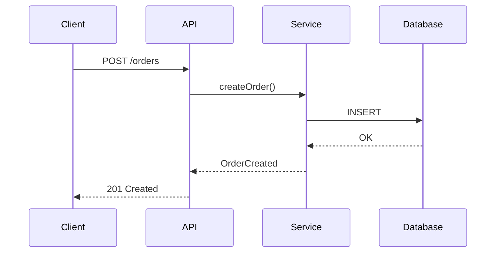

# Service Documentation Standard (RFC-37)

## Contents

- [Directory Structure](#directory-structure)
- [Documentation Types](#documentation-types)
- [Markdown Formatting Guidelines](#markdown-formatting-guidelines)
- [Required Documentation](#required-documentation)
- [Best Practices](#best-practices)
- [Mirroring to Confluence](#mirroring-to-confluence)
- [Mermaid Diagram Example](#mermaid-diagram-example)

---
## Directory Structure

Follow this standardized directory structure for documentation:

```text
docs/
├── api/
│   ├── async/
│   ├── grpc/
│   └── rest/
├── decisions/
├── <domain-name>/
│   ├── concepts/
│   ├── getting-started/
│   └── <feature-1/2/N>/
├── runbooks/
└── how-tos/
    └── local-execution.md
```

## Documentation Types

### API Documentation

| Directory | Purpose |
|-----------|---------|
| `api/async/` | Documentation for asynchronous APIs |
| `api/grpc/` | Documentation for gRPC APIs |
| `api/rest/` | Documentation for REST APIs |

### Decision Records

- `decisions/` - Architecture Decision Records (ADRs)
- Use format: `NNNN-title-with-hyphens.md` (e.g., `0001-dynamic-parser.md`)

### Service Documentation

| Directory | Purpose |
|-----------|---------|
| `<service-name>/concepts/` | Core domain concepts, architecture, components |
| `<service-name>/getting-started/` | Quick tutorials to get started |
| `<service-name>/<feature>/` | Documentation for specific features |

### Operational Documentation

| Directory | Purpose |
|-----------|---------|
| `runbooks/` | Step-by-step guides for operational procedures |
| `how-tos/` | Instructions for common tasks (must include `local-execution.md`) |

## Markdown Formatting Guidelines

- Use paragraphs as single lines (no line breaks within paragraphs)
- Use proper section anchors for internal links
- Use diagrams-as-code with Mermaid whenever possible
- Export other diagrams to SVG format for version control
- Include code examples with proper syntax highlighting

## Required Documentation

At minimum, documentation should include:

- Instructions to run the service locally (`how-tos/local-execution.md`)
- Instructions to test each feature's happy path
- C4 model diagrams showing service stakeholders and dependencies
- Decision records for significant architectural decisions

## Best Practices

- Keep documentation close to code and part of the same repository
- Update documentation as part of the Definition of Done
- Document only meaningful parts to avoid documentation bloat
- Create decision records for significant features/changes/decisions
- Document topics that are frequently explained to different people
- Use Mermaid diagrams for sequence diagrams and other visualizations

## Mirroring to Confluence

Documentation will be mirrored to Confluence following this path:
`<space>/<path-to-fleet>/<service-owner-squad>/<path-to-engineering-docs>/<repository-name>/`

Include appropriate metadata in markdown files:

```markdown
<!-- Parent: Stocks ADRs -->
<!-- Title: 0001 Buy Flow -->
```

## Mermaid Diagram Example

```markdown

```
<!-- AUTO-GENERATED FILE - DO NOT EDIT DIRECTLY -->
<!-- Source: bitsoex/ai-code-instructions → java/skills/rest-api/references/documentation.md -->
<!-- To modify, edit the source file and run the distribution workflow -->

